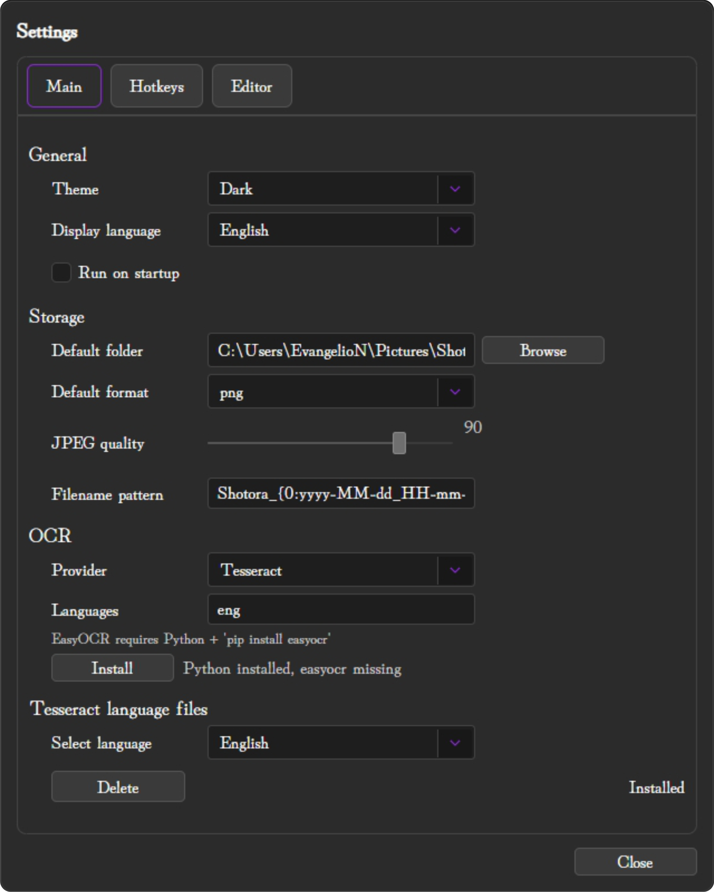
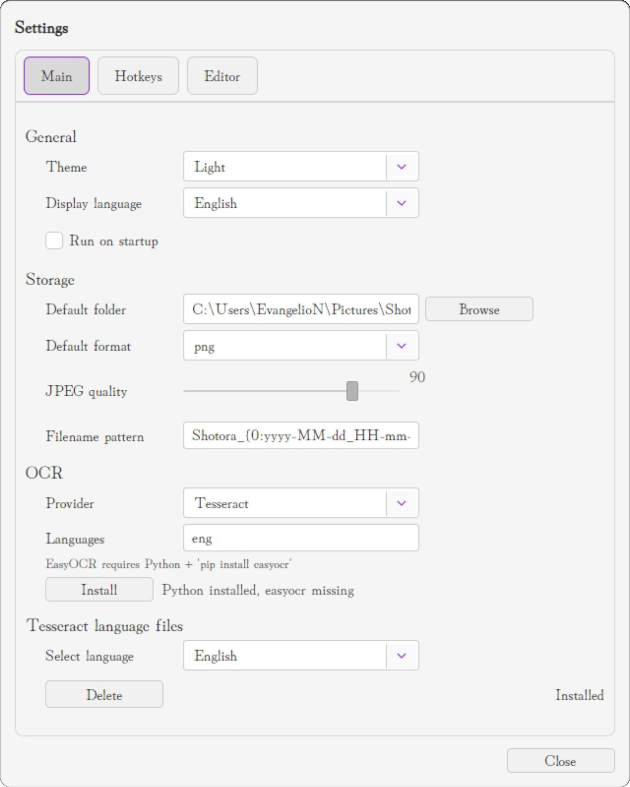
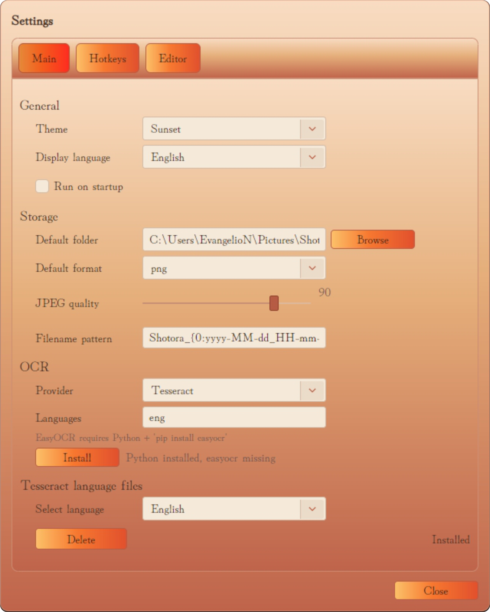
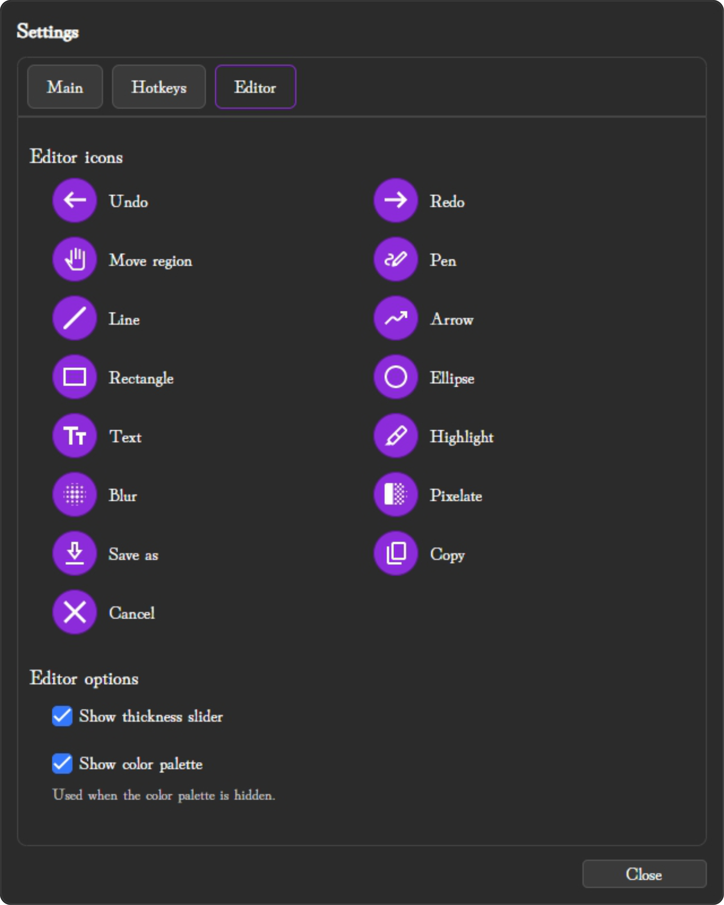
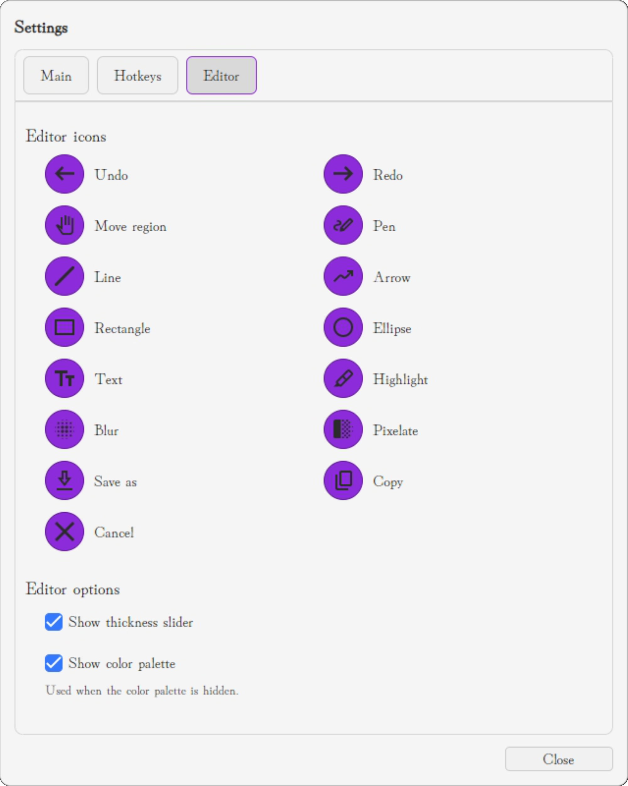
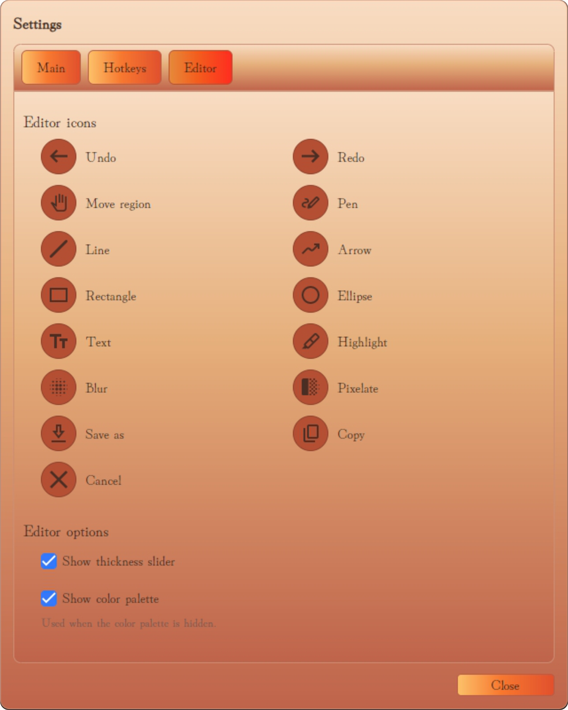
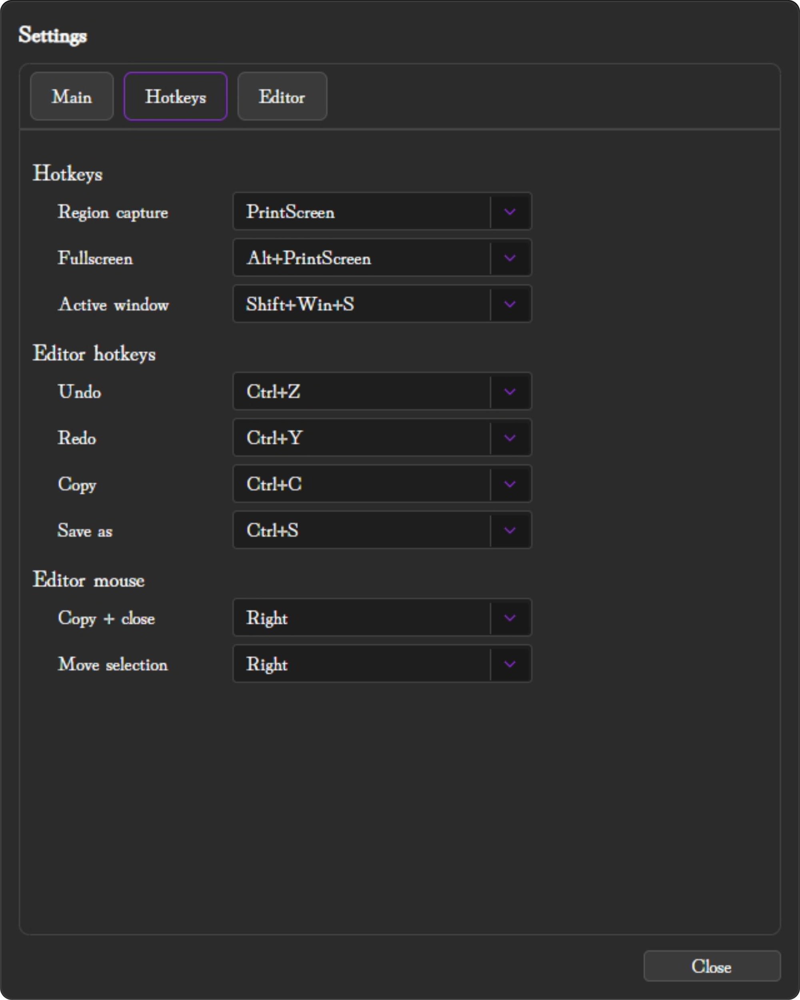
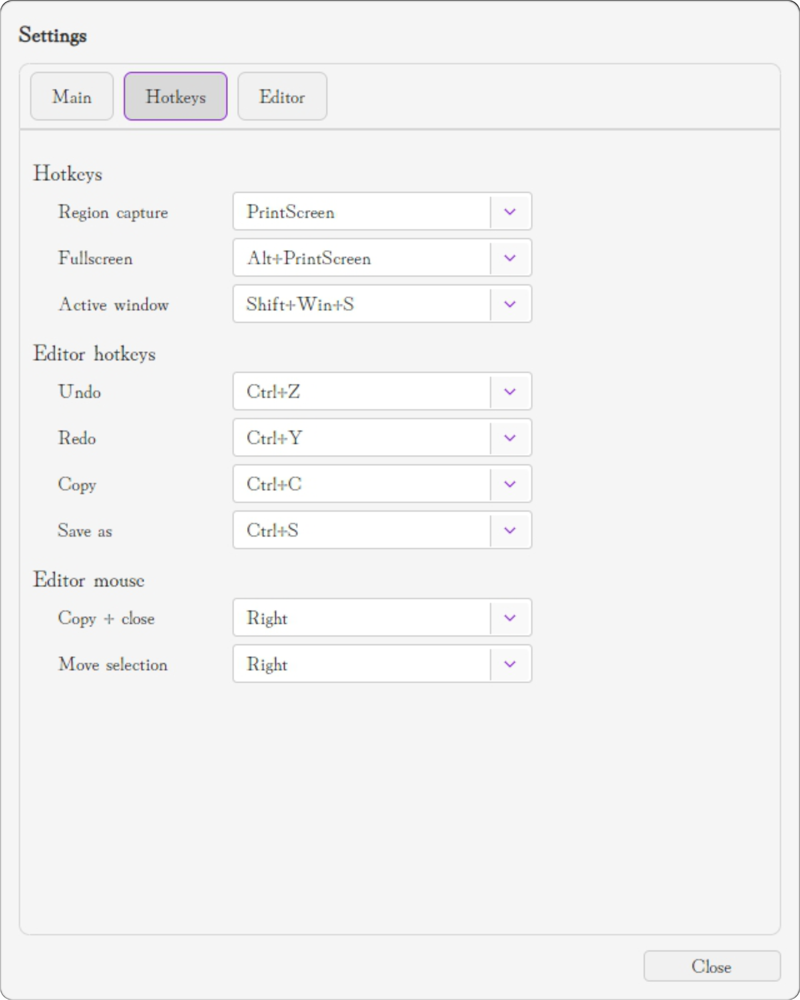
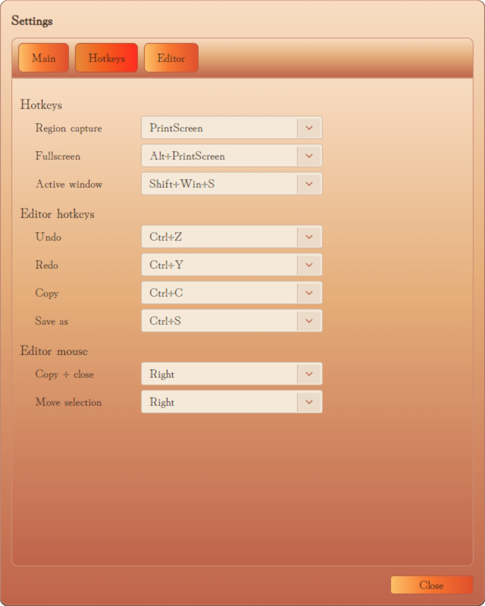
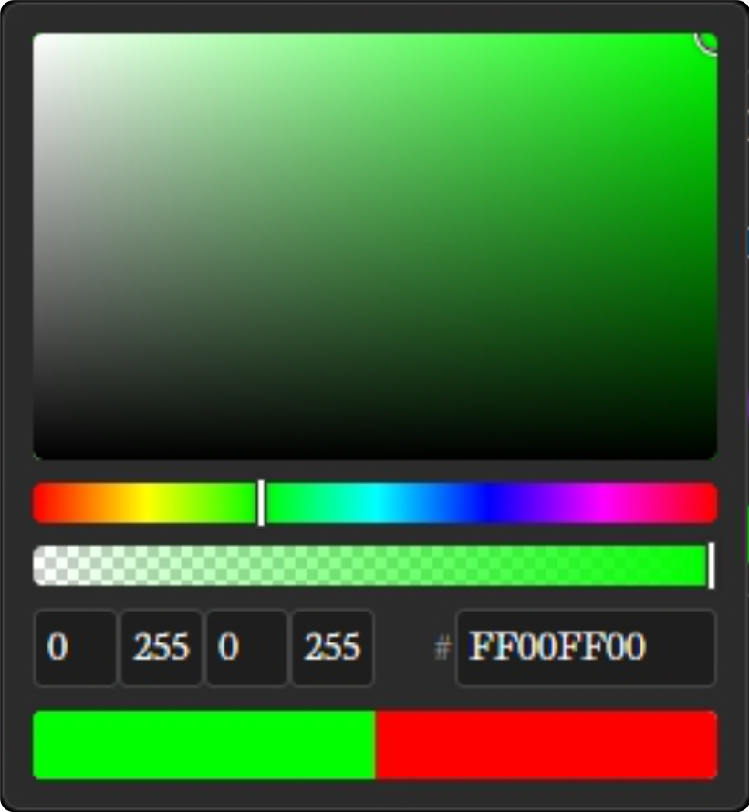

<div align="center">
  
  <h1>Shotora</h1>
  <p>A modern, privacy-focused screenshot tool with powerful annotation and local OCR capabilities.</p>

  <p>
    <a href="LICENSE">
      
    </a>
    
    
    
  </p>

  <p>
    
    
  </p>

  <p>
    
    
    
  </p>

<!-- GitHub Release & Downloads -->
[](https://github.com/Adhamura/Shotora/releases/latest)
[](https://github.com/Adhamura/Shotora/releases/latest)
[](https://github.com/Adhamura/Shotora/releases)

<!-- Social & Contact -->
[](https://www.linkedin.com/in/kazuki-kimura/)
[](mailto:kazuki.kimura.jp@com)
[](https://line.me/ti/p/adhamura)
[](https://www.kazukikimura.com)
[](https://www.instagram.com/kimura_kazuki_official/)

<!-- top of README.md -->

  <p>
    <a href="#-features">Features</a> •
    <a href="#-installation">Installation</a> •
    <a href="#-usage">Usage</a> •
    <a href="#-ocr-engines">OCR</a> •
    <a href="#-development">Development</a> •
    <a href="#-license">License</a>
  </p>
</div>

---

<div align="center">
  <p>Made with ❤️ for productivity</p>
  <p>
    <strong>⭐ Star this repo if you find it useful!</strong>
  </p>
</div>

---

## ✨ Features

### 🖼️ Screen Capture
- **Multi-monitor support** — Capture across all connected displays
- **Flexible modes** — Region selection, fullscreen, or active window
- **Resizable selection** — Fine-tune your capture area with precision handles
- **Smart positioning** — Movable tool palette that stays out of your way

### ✏️ Annotation Tools
| Tool                                                                                                                                                                                                                                                                                                                                                                                                                                                                                                                                                                                                                                                                                                                                                                                                                                                                                                                                                                                                                                                                                                                                                                                                                                                                                                                                                                                                                                                                                                                                                                                                                                                                                                                                                                                                                                                                                                                                                                                                                                                                                                                                                                                                                                                                                                                                                                                                                                                                                                                                                                                                                                                                                                                                                                                                                                                                                                                                                                                                                                                                                                                                                                                                                                                                                                                                                                                                                                                                                                                                                                                                                                                                                                                                                                                                                                                                                                                                                                                                                                                                                                         | Description |
|--------------------------------------------------------------------------------------------------------------------------------------------------------------------------------------------------------------------------------------------------------------------------------------------------------------------------------------------------------------------------------------------------------------------------------------------------------------------------------------------------------------------------------------------------------------------------------------------------------------------------------------------------------------------------------------------------------------------------------------------------------------------------------------------------------------------------------------------------------------------------------------------------------------------------------------------------------------------------------------------------------------------------------------------------------------------------------------------------------------------------------------------------------------------------------------------------------------------------------------------------------------------------------------------------------------------------------------------------------------------------------------------------------------------------------------------------------------------------------------------------------------------------------------------------------------------------------------------------------------------------------------------------------------------------------------------------------------------------------------------------------------------------------------------------------------------------------------------------------------------------------------------------------------------------------------------------------------------------------------------------------------------------------------------------------------------------------------------------------------------------------------------------------------------------------------------------------------------------------------------------------------------------------------------------------------------------------------------------------------------------------------------------------------------------------------------------------------------------------------------------------------------------------------------------------------------------------------------------------------------------------------------------------------------------------------------------------------------------------------------------------------------------------------------------------------------------------------------------------------------------------------------------------------------------------------------------------------------------------------------------------------------------------------------------------------------------------------------------------------------------------------------------------------------------------------------------------------------------------------------------------------------------------------------------------------------------------------------------------------------------------------------------------------------------------------------------------------------------------------------------------------------------------------------------------------------------------------------------------------------------------------------------------------------------------------------------------------------------------------------------------------------------------------------------------------------------------------------------------------------------------------------------------------------------------------------------------------------------------------------------------------------------------------------------------------------------------------------------------------|-------------|
| ![](https://img.shields.io/badge/-white?style=plastic&logo=data:image/svg+xml;base64,PHN2ZyB4bWxucz0naHR0cDovL3d3dy53My5vcmcvMjAwMC9zdmcnIHZpZXdCb3g9JzQwIC03NjAgODgwIDYwMC45NDEnPjxwYXRoIGZpbGw9JyNBRDY0ZjUnIGZpbGwtcnVsZT0nZXZlbm9kZCcgZD0nTTc4MiwtNjc0TDQ0NywtMzM5TDQ5OSwtMjg3TDgzNCwtNjIyTDc4MiwtNjc0Wk0yMDAsLTY4MEMyNjguNjY3LC02NzQuNjY3LDMxOS4xNjcsLTY2MC44MzMsMzUxLjUsLTYzOC41QzM4My44MzMsLTYxNi4xNjcsNDAwLC01ODQsNDAwLC01NDJDNDAwLC01MDYuNjY3LDM4Ny4xNjcsLTQ3OSwzNjEuNSwtNDU5QzMzNS44MzMsLTQzOSwyOTgsLTQyNywyNDgsLTQyM0MyMDUuMzMzLC00MTkuNjY3LDE3My4zMzMsLTQxMS44MzMsMTUyLC0zOTkuNUMxMzAuNjY3LC0zODcuMTY3LDEyMCwtMzcwLjMzMywxMjAsLTM0OUMxMjAsLTMyNS42NjcsMTI5LjMzMywtMzA4LjgzMywxNDgsLTI5OC41QzE2Ni42NjcsLTI4OC4xNjcsMTk4LC0yODIsMjQyLC0yODBMMjM4LC0yMDBDMTcxLjMzMywtMjAzLjMzMywxMjEuNjY3LC0yMTcuMzMzLDg5LC0yNDJDNTYuMzMzLC0yNjYuNjY3LDQwLC0zMDIuMzMzLDQwLC0zNDlDNDAsLTM5Mi4zMzMsNTcuODMzLC00MjcuNSw5My41LC00NTQuNUMxMjkuMTY3LC00ODEuNSwxNzguNjY3LC00OTcuNjY3LDI0MiwtNTAzQzI2OCwtNTA1LDI4Ny41LC01MDkuMTY3LDMwMC41LC01MTUuNUMzMTMuNSwtNTIxLjgzMywzMjAsLTUzMC42NjcsMzIwLC01NDJDMzIwLC01NTkuMzMzLDMxMC4xNjcsLTU3Mi4zMzMsMjkwLjUsLTU4MUMyNzAuODMzLC01ODkuNjY3LDIzOC4zMzMsLTU5NiwxOTMsLTYwMEwyMDAsLTY4MFpNNzgyLjUsLTc2MEM4MDAuODMzLC03NjAsODE2LjY2NywtNzUzLjMzMyw4MzAsLTc0MEw5MDAsLTY3MEM5MTMuMzMzLC02NTYuNjY3LDkyMCwtNjQwLjgzMyw5MjAsLTYyMi41QzkyMCwtNjA0LjE2Nyw5MTMuMzMzLC01ODguMzMzLDkwMCwtNTc1TDUxOCwtMTkzTDM1OSwtMTYwQzM0Ny42NjcsLTE1Ny4zMzMsMzM3LjY2NywtMTYwLjMzMywzMjksLTE2OUMzMjAuMzMzLC0xNzcuNjY3LDMxNy4zMzMsLTE4Ny42NjcsMzIwLC0xOTlMMzUzLC0zNThMNzM1LC03NDBDNzQ4LjMzMywtNzUzLjMzMyw3NjQuMTY3LC03NjAsNzgyLjUsLTc2MFonLz48L3N2Zz4=) **IconPen**                                                                                                                                                                                                                                                                                                                                                                                                                                                                                                                                                                                                                                                                                                                                                                                                                                                                                                                                                                                                                                                                                                                                                                                                                                                                                                                                                                                                                                                                                                                                                                                                                                                                                                                                                                                                                                                                                                                                                                                                                                                                                                                                                                                                                                                                                                                                                                                                                                                      | Freehand drawing with customizable thickness |
|  **Line**                                                                                                                                                                                                                                                                                                                                                                                                                                                                                                                                                                                                                                                                                                                                                                                                                                                                                                                                                                                                                                                                                                                                                                                                                                                                                                                                                                                                                                                                                                                                                                                                                                                                                                                                                                                                                                                                                                                                                                                                                                                                                                                                                                                                                                                                                                                                                                                                                                                                                                                                                                                                                                                                                                                                                                                                                                                                                                                                                                                                                                                                                                                                                                                                                                                                                                                                                                                         | Straight lines for precise markups |
|  **Arrow**                                                                                                                                                                                                                                                                                                                                                                                                                                                                                                                                                                                                                                                                                                                                                                                                                                                                                                                                                                                                                                                                                                                                                                                                                                                                                                                                                                                                                                                                                                                                                                                                                                                                                                                                                                                                                                                                                                                                                                                                                                                                                                                                                                                                                                                                                                                                                                                                                                                                                                                                                                                                                                                                                                                                                                                                                                                                                                                                                                                                                                                                                                                                                                                                                                                                | Directional arrows to highlight important areas |
|  **Rectangle**                                                                                                                                                                                                                                                                                                                                                                                                                                                                                                                                                                                                                                                                                                                                                                                                                                                                                                                                                                                                                                                                                                                                                                                                                                                                                                                                                                                                                                                                                                                                                                                                                                                                                                                                                                                                                                                                                                                                                                                                                                                                                                                                                                                                                                                                                                                                                                                                                                                                                                                                                                                                                                                                                                                                                                                                                                                                                                                                                                                                                                                                                                                                                                                                                                                                                                                                                                                                                                                                                                                                                                                                                                                                                                                    | Rectangular shapes and outlines |
| ![](https://img.shields.io/badge/-white?style=plastic&logo=data:image/svg+xml;base64,PHN2ZyB4bWxucz0naHR0cDovL3d3dy53My5vcmcvMjAwMC9zdmcnIHZpZXdCb3g9JzgwIC04ODAgODAwIDgwMCc+PHBhdGggZmlsbD0nI0FENjRmNScgZmlsbC1ydWxlPSdldmVub2RkJyBkPSdNNDgwLC04MDBDMzkwLjY2NywtODAwLDMxNSwtNzY5LDI1MywtNzA3QzE5MSwtNjQ1LDE2MCwtNTY5LjMzMywxNjAsLTQ4MEMxNjAsLTM5MC42NjcsMTkxLC0zMTUsMjUzLC0yNTNDMzE1LC0xOTEsMzkwLjY2NywtMTYwLDQ4MCwtMTYwQzU2OS4zMzMsLTE2MCw2NDUsLTE5MSw3MDcsLTI1M0M3NjksLTMxNSw4MDAsLTM5MC42NjcsODAwLC00ODBDODAwLC01NjkuMzMzLDc2OSwtNjQ1LDcwNywtNzA3QzY0NSwtNzY5LDU2OS4zMzMsLTgwMCw0ODAsLTgwMFpNNDgwLC04ODBDNTM1LjMzMywtODgwLDU4Ny4zMzMsLTg2OS41LDYzNiwtODQ4LjVDNjg0LjY2NywtODI3LjUsNzI3LC03OTksNzYzLC03NjNDNzk5LC03MjcsODI3LjUsLTY4NC42NjcsODQ4LjUsLTYzNkM4NjkuNSwtNTg3LjMzMyw4ODAsLTUzNS4zMzMsODgwLC00ODBDODgwLC00MjQuNjY3LDg2OS41LC0zNzIuNjY3LDg0OC41LC0zMjRDODI3LjUsLTI3NS4zMzMsNzk5LC0yMzMsNzYzLC0xOTdDNzI3LC0xNjEsNjg0LjY2NywtMTMyLjUsNjM2LC0xMTEuNUM1ODcuMzMzLC05MC41LDUzNS4zMzMsLTgwLDQ4MCwtODBDNDI0LjY2NywtODAsMzcyLjY2NywtOTAuNSwzMjQsLTExMS41QzI3NS4zMzMsLTEzMi41LDIzMywtMTYxLDE5NywtMTk3QzE2MSwtMjMzLDEzMi41LC0yNzUuMzMzLDExMS41LC0zMjRDOTAuNSwtMzcyLjY2Nyw4MCwtNDI0LjY2Nyw4MCwtNDgwQzgwLC01MzUuMzMzLDkwLjUsLTU4Ny4zMzMsMTExLjUsLTYzNkMxMzIuNSwtNjg0LjY2NywxNjEsLTcyNywxOTcsLTc2M0MyMzMsLTc5OSwyNzUuMzMzLC04MjcuNSwzMjQsLTg0OC41QzM3Mi42NjcsLTg2OS41LDQyNC42NjcsLTg4MCw0ODAsLTg4MFonLz48L3N2Zz4=) **Ellipse**                                                                                                                                                                                                                                                                                                                                                                                                                                                                                                                                                                                                                                                                                                                                                                                                                                                                                                                                                                                                                                                                                                                                                                                                                                                                                                                                                                                                                                                                                                                                                                                                                                                                                                                                                                                                                                                                                                                                                                                                                                                                                                                                                                                                                                                                                                                                                                                                                                                                                                                                                                                                                                                                                      | Circular and oval shapes |
|  **Text**                                                                                                                                                                                                                                                                                                                                                                                                                                                                                                                                                                                                                                                                                                                                                                                                                                                                                                                                                                                                                                                                                                                                                                                                                                                                                                                                                                                                                                                                                                                                                                                                                                                                                                                                                                                                                                                                                                                                                                                                                                                                                                                                                                                                                                                                                                                                                                                                                                                                                                                                                                                                                                                                                                                                                                                                                                                                                                                                                                                                                                                                                                                                                                                                                                                                                                                                                                                                                                                                                                                                                                                                                         | Add text annotations with font customization |
|  **Highlight**                                                                                                                                                                                                                                                                                                                                                                                                                                                                                                                                                                                                                                                                                                                                                                                                                                                                                                                                                                                                                                                                                                                                                                                                                                                                                                                                                                                                                                                                                                                                                                                                                                                                                                                                                                                                                                                                                                                                                                                                                                                                                                                                                                                                                                                                                                                                                                                                                                                                                                                                                                                                                                                                                                                                                                                                                                                                                                                                                                                                                                                                                                                                                                                                                                    | Semi-transparent highlighting |
| ![](https://img.shields.io/badge/-white?style=plastic&logo=data:image/svg+xml;base64,PHN2ZyB4bWxucz0naHR0cDovL3d3dy53My5vcmcvMjAwMC9zdmcnIHZpZXdCb3g9JzEyMCAtODQwIDc0MCA3MjAnPjxwYXRoIGZpbGw9JyNBRDY0ZjUnIGZpbGwtcnVsZT0nZXZlbm9kZCcgZD0nTTY0MCwtMjAwTDY2OC41LC0xODguNUw2ODAsLTE2MEw2NjguNSwtMTMxLjVMNjQwLC0xMjBMNjExLjUsLTEzMS41TDYwMCwtMTYwTDYxMS41LC0xODguNUw2NDAsLTIwMFpNNDgwLC0yMDBMNTA4LjUsLTE4OC41TDUyMCwtMTYwTDUwOC41LC0xMzEuNUw0ODAsLTEyMEw0NTEuNSwtMTMxLjVMNDQwLC0xNjBMNDUxLjUsLTE4OC41TDQ4MCwtMjAwWk03MjAsLTI4MEw3NDguNSwtMjY4LjVMNzYwLC0yNDBMNzQ4LjUsLTIxMS41TDcyMCwtMjAwTDY5MS41LC0yMTEuNUw2ODAsLTI0MEw2OTEuNSwtMjY4LjVMNzIwLC0yODBaTTU2MCwtMjgwTDU4OC41LC0yNjguNUw2MDAsLTI0MEw1ODguNSwtMjExLjVMNTYwLC0yMDBMNTMxLjUsLTIxMS41TDUyMCwtMjQwTDUzMS41LC0yNjguNUw1NjAsLTI4MFpNNjQwLC0zNjBMNjY4LjUsLTM0OC41TDY4MCwtMzIwTDY2OC41LC0yOTEuNUw2NDAsLTI4MEw2MTEuNSwtMjkxLjVMNjAwLC0zMjBMNjExLjUsLTM0OC41TDY0MCwtMzYwWk00ODAsLTM2MEw1MDguNSwtMzQ4LjVMNTIwLC0zMjBMNTA4LjUsLTI5MS41TDQ4MCwtMjgwTDQ1MS41LC0yOTEuNUw0NDAsLTMyMEw0NTEuNSwtMzQ4LjVMNDgwLC0zNjBaTTg0MCwtNDIwTDg1NCwtNDE0TDg2MCwtNDAwTDg1NCwtMzg2TDg0MCwtMzgwTDgyNiwtMzg2TDgyMCwtNDAwTDgyNiwtNDE0TDg0MCwtNDIwWk03MjAsLTQ0MEw3NDguNSwtNDI4LjVMNzYwLC00MDBMNzQ4LjUsLTM3MS41TDcyMCwtMzYwTDY5MS41LC0zNzEuNUw2ODAsLTQwMEw2OTEuNSwtNDI4LjVMNzIwLC00NDBaTTU2MCwtNDQwTDU4OC41LC00MjguNUw2MDAsLTQwMEw1ODguNSwtMzcxLjVMNTYwLC0zNjBMNTMxLjUsLTM3MS41TDUyMCwtNDAwTDUzMS41LC00MjguNUw1NjAsLTQ0MFpNNjQwLC01MjBMNjY4LjUsLTUwOC41TDY4MCwtNDgwTDY2OC41LC00NTEuNUw2NDAsLTQ0MEw2MTEuNSwtNDUxLjVMNjAwLC00ODBMNjExLjUsLTUwOC41TDY0MCwtNTIwWk00ODAsLTUyMEw1MDguNSwtNTA4LjVMNTIwLC00ODBMNTA4LjUsLTQ1MS41TDQ4MCwtNDQwTDQ1MS41LC00NTEuNUw0NDAsLTQ4MEw0NTEuNSwtNTA4LjVMNDgwLC01MjBaTTg0MCwtNTgwTDg1NCwtNTc0TDg2MCwtNTYwTDg1NCwtNTQ2TDg0MCwtNTQwTDgyNiwtNTQ2TDgyMCwtNTYwTDgyNiwtNTc0TDg0MCwtNTgwWk03MjAsLTYwMEw3NDguNSwtNTg4LjVMNzYwLC01NjBMNzQ4LjUsLTUzMS41TDcyMCwtNTIwTDY5MS41LC01MzEuNUw2ODAsLTU2MEw2OTEuNSwtNTg4LjVMNzIwLC02MDBaTTU2MCwtNjAwTDU4OC41LC01ODguNUw2MDAsLTU2MEw1ODguNSwtNTMxLjVMNTYwLC01MjBMNTMxLjUsLTUzMS41TDUyMCwtNTYwTDUzMS41LC01ODguNUw1NjAsLTYwMFpNNjQwLC02ODBMNjY4LjUsLTY2OC41TDY4MCwtNjQwTDY2OC41LC02MTEuNUw2NDAsLTYwMEw2MTEuNSwtNjExLjVMNjAwLC02NDBMNjExLjUsLTY2OC41TDY0MCwtNjgwWk00ODAsLTY4MEw1MDguNSwtNjY4LjVMNTIwLC02NDBMNTA4LjUsLTYxMS41TDQ4MCwtNjAwTDQ1MS41LC02MTEuNUw0NDAsLTY0MEw0NTEuNSwtNjY4LjVMNDgwLC02ODBaTTcyMCwtNzYwTDc0OC41LC03NDguNUw3NjAsLTcyMEw3NDguNSwtNjkxLjVMNzIwLC02ODBMNjkxLjUsLTY5MS41TDY4MCwtNzIwTDY5MS41LC03NDguNUw3MjAsLTc2MFpNNTYwLC03NjBMNTg4LjUsLTc0OC41TDYwMCwtNzIwTDU4OC41LC02OTEuNUw1NjAsLTY4MEw1MzEuNSwtNjkxLjVMNTIwLC03MjBMNTMxLjUsLTc0OC41TDU2MCwtNzYwWk02NDAsLTg0MEw2NjguNSwtODI4LjVMNjgwLC04MDBMNjY4LjUsLTc3MS41TDY0MCwtNzYwTDYxMS41LC03NzEuNUw2MDAsLTgwMEw2MTEuNSwtODI4LjVMNjQwLC04NDBaTTQ4MCwtODQwTDUwOC41LC04MjguNUw1MjAsLTgwMEw1MDguNSwtNzcxLjVMNDgwLC03NjBMNDUxLjUsLTc3MS41TDQ0MCwtODAwTDQ1MS41LC04MjguNUw0ODAsLTg0MFpNMjAwLC04NDBMNDAwLC04NDBMNDAwLC0xMjBMMjAwLC0xMjBMMTY5LjM3NSwtMTI1Ljg3NUwxNDMuNSwtMTQzLjVMMTI1Ljg3NSwtMTY5LjM3NUwxMjAsLTIwMEwxMjAsLTc2MEwxMjUuODc1LC03OTAuNjI1TDE0My41LC04MTYuNUwxNjkuMzc1LC04MzQuMTI1TDIwMCwtODQwWicvPjwvc3ZnPg==) **Blur**                                                                                                                                                                                                                                                                                                                                                                                                                                                                                                                                                                                                                                                                                                                                                                                                                                                                                                                                                 | Redact sensitive information |
| ![](https://img.shields.io/badge/-white?style=plastic&logo=data:image/svg+xml;base64,PHN2ZyB4bWxucz0naHR0cDovL3d3dy53My5vcmcvMjAwMC9zdmcnIHZpZXdCb3g9JzEwMCAtODYwIDc2MCA3NjAnPjxwYXRoIGZpbGw9JyNBRDY0ZjUnIGZpbGwtcnVsZT0nZXZlbm9kZCcgZD0nTTU2MCwtMTQwTDU3NCwtMTM0TDU4MCwtMTIwTDU3NCwtMTA2TDU2MCwtMTAwTDU0NiwtMTA2TDU0MCwtMTIwTDU0NiwtMTM0TDU2MCwtMTQwWk00MDAsLTE0MEw0MTQsLTEzNEw0MjAsLTEyMEw0MTQsLTEwNkw0MDAsLTEwMEwzODYsLTEwNkwzODAsLTEyMEwzODYsLTEzNEw0MDAsLTE0MFpNNzIwLC0yODBMNzQ4LjUsLTI2OC41TDc2MCwtMjQwTDc0OC41LC0yMTEuNUw3MjAsLTIwMEw2OTEuNSwtMjExLjVMNjgwLC0yNDBMNjkxLjUsLTI2OC41TDcyMCwtMjgwWk01NjAsLTI4MEw1ODguNSwtMjY4LjVMNjAwLC0yNDBMNTg4LjUsLTIxMS41TDU2MCwtMjAwTDUzMS41LC0yMTEuNUw1MjAsLTI0MEw1MzEuNSwtMjY4LjVMNTYwLC0yODBaTTQwMCwtMjgwTDQyOC41LC0yNjguNUw0NDAsLTI0MEw0MjguNSwtMjExLjVMNDAwLC0yMDBMMzcxLjUsLTIxMS41TDM2MCwtMjQwTDM3MS41LC0yNjguNUw0MDAsLTI4MFpNMjQwLC0yODBMMjY4LjUsLTI2OC41TDI4MCwtMjQwTDI2OC41LC0yMTEuNUwyNDAsLTIwMEwyMTEuNSwtMjExLjVMMjAwLC0yNDBMMjExLjUsLTI2OC41TDI0MCwtMjgwWk04NDAsLTQyMEw4NTQsLTQxNEw4NjAsLTQwMEw4NTQsLTM4Nkw4NDAsLTM4MEw4MjYsLTM4Nkw4MjAsLTQwMEw4MjYsLTQxNEw4NDAsLTQyMFpNMTIwLC00MjBMMTM0LC00MTRMMTQwLC00MDBMMTM0LC0zODZMMTIwLC0zODBMMTA2LC0zODZMMTAwLC00MDBMMTA2LC00MTRMMTIwLC00MjBaTTcyMCwtNDQwTDc0OC41LC00MjguNUw3NjAsLTQwMEw3NDguNSwtMzcxLjVMNzIwLC0zNjBMNjkxLjUsLTM3MS41TDY4MCwtNDAwTDY5MS41LC00MjguNUw3MjAsLTQ0MFpNMjQwLC00NDBMMjY4LjUsLTQyOC41TDI4MCwtNDAwTDI2OC41LC0zNzEuNUwyNDAsLTM2MEwyMTEuNSwtMzcxLjVMMjAwLC00MDBMMjExLjUsLTQyOC41TDI0MCwtNDQwWk01NjAsLTQ2MEw1ODMuMTI1LC00NTUuNjI1TDYwMi41LC00NDIuNUw2MTUuNjI1LC00MjMuMTI1TDYyMCwtNDAwTDYxNS42MjUsLTM3Ni44NzVMNjAyLjUsLTM1Ny41TDU4My4xMjUsLTM0NC4zNzVMNTYwLC0zNDBMNTM2Ljg3NSwtMzQ0LjM3NUw1MTcuNSwtMzU3LjVMNTA0LjM3NSwtMzc2Ljg3NUw1MDAsLTQwMEw1MDQuMzc1LC00MjMuMTI1TDUxNy41LC00NDIuNUw1MzYuODc1LC00NTUuNjI1TDU2MCwtNDYwWk00MDAsLTQ2MEw0MjMuMTI1LC00NTUuNjI1TDQ0Mi41LC00NDIuNUw0NTUuNjI1LC00MjMuMTI1TDQ2MCwtNDAwTDQ1NS42MjUsLTM3Ni44NzVMNDQyLjUsLTM1Ny41TDQyMy4xMjUsLTM0NC4zNzVMNDAwLC0zNDBMMzc2Ljg3NSwtMzQ0LjM3NUwzNTcuNSwtMzU3LjVMMzQ0LjM3NSwtMzc2Ljg3NUwzNDAsLTQwMEwzNDQuMzc1LC00MjMuMTI1TDM1Ny41LC00NDIuNUwzNzYuODc1LC00NTUuNjI1TDQwMCwtNDYwWk04NDAsLTU4MEw4NTQsLTU3NEw4NjAsLTU2MEw4NTQsLTU0Nkw4NDAsLTU0MEw4MjYsLTU0Nkw4MjAsLTU2MEw4MjYsLTU3NEw4NDAsLTU4MFpNMTIwLC01ODBMMTM0LC01NzRMMTQwLC01NjBMMTM0LC01NDZMMTIwLC01NDBMMTA2LC01NDZMMTAwLC01NjBMMTA2LC01NzRMMTIwLC01ODBaTTcyMCwtNjAwTDc0OC41LC01ODguNUw3NjAsLTU2MEw3NDguNSwtNTMxLjVMNzIwLC01MjBMNjkxLjUsLTUzMS41TDY4MCwtNTYwTDY5MS41LC01ODguNUw3MjAsLTYwMFpNMjQwLC02MDBMMjY4LjUsLTU4OC41TDI4MCwtNTYwTDI2OC41LC01MzEuNUwyNDAsLTUyMEwyMTEuNSwtNTMxLjVMMjAwLC01NjBMMjExLjUsLTU4OC41TDI0MCwtNjAwWk01NjAsLTYyMEw1ODMuMTI1LC02MTUuNjI1TDYwMi41LC02MDIuNUw2MTUuNjI1LC01ODMuMTI1TDYyMCwtNTYwTDYxNS42MjUsLTUzNi44NzVMNjAyLjUsLTUxNy41TDU4My4xMjUsLTUwNC4zNzVMNTYwLC01MDBMNTM2Ljg3NSwtNTA0LjM3NUw1MTcuNSwtNTE3LjVMNTA0LjM3NSwtNTM2Ljg3NUw1MDAsLTU2MEw1MDQuMzc1LC01ODMuMTI1TDUxNy41LC02MDIuNUw1MzYuODc1LC02MTUuNjI1TDU2MCwtNjIwWk00MDAsLTYyMEw0MjMuMTI1LC02MTUuNjI1TDQ0Mi41LC02MDIuNUw0NTUuNjI1LC01ODMuMTI1TDQ2MCwtNTYwTDQ1NS42MjUsLTUzNi44NzVMNDQyLjUsLTUxNy41TDQyMy4xMjUsLTUwNC4zNzVMNDAwLC01MDBMMzc2Ljg3NSwtNTA0LjM3NUwzNTcuNSwtNTE3LjVMMzQ0LjM3NSwtNTM2Ljg3NUwzNDAsLTU2MEwzNDQuMzc1LC01ODMuMTI1TDM1Ny41LC02MDIuNUwzNzYuODc1LC02MTUuNjI1TDQwMCwtNjIwWk03MjAsLTc2MEw3NDguNSwtNzQ4LjVMNzYwLC03MjBMNzQ4LjUsLTY5MS41TDcyMCwtNjgwTDY5MS41LC02OTEuNUw2ODAsLTcyMEw2OTEuNSwtNzQ4LjVMNzIwLC03NjBaTTU2MCwtNzYwTDU4OC41LC03NDguNUw2MDAsLTcyMEw1ODguNSwtNjkxLjVMNTYwLC02ODBMNTMxLjUsLTY5MS41TDUyMCwtNzIwTDUzMS41LC03NDguNUw1NjAsLTc2MFpNNDAwLC03NjBMNDI4LjUsLTc0OC41TDQ0MCwtNzIwTDQyOC41LC02OTEuNUw0MDAsLTY4MEwzNzEuNSwtNjkxLjVMMzYwLC03MjBMMzcxLjUsLTc0OC41TDQwMCwtNzYwWk0yNDAsLTc2MEwyNjguNSwtNzQ4LjVMMjgwLC03MjBMMjY4LjUsLTY5MS41TDI0MCwtNjgwTDIxMS41LC02OTEuNUwyMDAsLTcyMEwyMTEuNSwtNzQ4LjVMMjQwLC03NjBaTTU2MCwtODYwTDU3NCwtODU0TDU4MCwtODQwTDU3NCwtODI2TDU2MCwtODIwTDU0NiwtODI2TDU0MCwtODQwTDU0NiwtODU0TDU2MCwtODYwWk00MDAsLTg2MEw0MTQsLTg1NEw0MjAsLTg0MEw0MTQsLTgyNkw0MDAsLTgyMEwzODYsLTgyNkwzODAsLTg0MEwzODYsLTg1NEw0MDAsLTg2MFonLz48L3N2Zz4=) **Pixelate** | Pixelate areas for privacy |

- **Undo/Redo** — Full history support
- **Color Palette** — Quick color selection with custom picker
- **Thickness Control** — Adjustable stroke width

### 🔍 OCR (Optical Character Recognition)
- **EasyOCR** — Python-based with 80+ language support
- **Tesseract** — Lightweight native engine with language packs
- **100% Local** — No cloud services, complete privacy
- **One-click install** — Managed directly from Settings

### 🎨 Customization
- **3 Themes** — Dark, Light, and Sunset
- **73+ Languages** — Extensive localization support
- **Custom Hotkeys** — Configure keyboard shortcuts
- **Export Options** — PNG, JPEG with quality control
- **Filename Patterns** — Customizable naming templates
- **Auto-save Folder** — Set your preferred destination

### 🖥️ Cross-Platform

| Edition | Framework | Platforms |
|---------|-----------|-----------|
| **Shotora.App** | Avalonia UI 11.3 | Windows, Linux, macOS |

---

## 📸 Screenshots

### Theme Showcase

<div align="center">

| Dark Theme | Light Theme | Sunset Theme |
|:----------:|:-----------:|:------------:|
|  |  |  |

</div>

### Editor Settings

<div align="center">

|                                         Dark                                          | Light | Sunset |
|:-------------------------------------------------------------------------------------:|:-----:|:------:|
|  |  |  |

</div>

### Hotkey Configuration

<div align="center">

| Dark | Light | Sunset |
|:----:|:-----:|:------:|
|  |  |  |

</div>

### UI Elements

<div align="center">

| Annotation Panel | Color Palette |
|:----------------:|:-------------:|
|  |  |

</div>

---

## 📦 Installation

### Prerequisites

- **.NET 10 SDK** — [Download](https://dotnet.microsoft.com/download/dotnet/10.0)
- **Python 3.11+** — Required only for EasyOCR (optional)

### Build from Source

```bash
# Clone the repository
git clone https://github.com/YourUsername/Shotora.git
cd Shotora

# Build the solution
dotnet build Shotora.sln

# Run Avalonia version (Cross-platform)
dotnet run --project Shotora.App/Shotora.App.csproj
```

### Build Profiles

The following build profiles are available for different platforms and configurations:

| Platform | Architecture | Action | Command |
|:--------:|:------------:|:------:|:--------|
|  | x64 | Publish & Pack | `dotnet-cake --runtime=win-x64 --singlefile=true --selfcontained=true` |
|  | x86 | Publish & Pack | `dotnet-cake --runtime=win-x86 --singlefile=true --selfcontained=true` |
|  | x64 | Publish Only | `dotnet-cake --runtime=linux-x64 --singlefile=true --selfcontained=true` |
|  | arm64 | Publish Only | `dotnet-cake --runtime=linux-arm64 --singlefile=true --selfcontained=true` |
|  | x64 | Publish & Pack | `dotnet-cake --runtime=osx-x64 --singlefile=true --selfcontained=true` |

> 💡 **Tip**: Run `dotnet tool restore` first to install Cake and Velopack CLI tools.

<details>
<summary>📋 <strong>Detailed Build Commands</strong></summary>

#### Windows (x64) — Publish and Pack
```powershell
dotnet tool run dotnet-cake --runtime=win-x64 --singlefile=true --selfcontained=true --output=./ready/win-x64
./build/pack-from-cake.ps1 -PackDir ./ready/win-x64 -Runtime win-x64 -Channel stable
```

#### Windows (x86) — Publish and Pack
```powershell
dotnet tool run dotnet-cake --runtime=win-x86 --singlefile=true --selfcontained=true --output=./ready/win-x86
./build/pack-from-cake.ps1 -PackDir ./ready/win-x86 -Runtime win-x86 -Channel stable
```

#### Linux (x64) — Publish Only
```bash
dotnet tool run dotnet-cake --runtime=linux-x64 --singlefile=true --selfcontained=true --output=./ready/linux-x64
```

#### Linux (arm64) — Publish Only
```bash
dotnet tool run dotnet-cake --runtime=linux-arm64 --singlefile=true --selfcontained=true --output=./ready/linux-arm64
```

#### macOS (x64) — Publish & Pack
```bash
dotnet tool run dotnet-cake --runtime=osx-x64 --singlefile=true --selfcontained=true --output=./ready/osx-x64
./build/pack-from-cake.ps1 -PackDir ./ready/osx-x64 -Runtime osx-x64 -Channel stable
```

</details>

### Publish (Self-Contained)

```bash
# Windows
dotnet publish Shotora.App/Shotora.App.csproj -c Release -r win-x64

# Linux
dotnet publish Shotora.App/Shotora.App.csproj -c Release -r linux-x64

# macOS
dotnet publish Shotora.App/Shotora.App.csproj -c Release -r osx-x64
```

### Velopack Setup (Windows)

- Install the pinned Velopack CLI: `dotnet tool restore` (uses `.config/dotnet-tools.json`; sets `DOTNET_ROLL_FORWARD=LatestMajor` automatically when packing).
- Build a branded Setup.exe with the Shotora splash (`build/Installer/splash.png`) and icon (`Shotora.App/Assets/Shotora.ico`):
  - `pwsh ./build/pack-setup.ps1 -Runtime win-x64 -Channel win -Version 1.0.0`
  - The script publishes `Shotora.App`, then runs `vpk pack` with the branded assets.
- Output artifacts land in `bin/velopack/<rid>/` (including `Setup.exe` and the release/portable packages).

---

## 🚀 Usage

### Quick Start

1. **Launch** — Shotora starts minimized in the system tray
2. **Capture** — Use hotkey or right-click tray icon
3. **Select** — Draw a region on screen
4. **Annotate** — Use the toolbar to mark up your capture
5. **Export** — Copy to clipboard, save to file, or extract text with OCR

### Default Hotkeys

| Action | Shortcut |
|--------|----------|
| Region Capture | `Ctrl + Shift + PrintScreen` |
| Fullscreen Capture | `Alt + PrintScreen` |
| Active Window | `Shift + Win + S` |

> 💡 All hotkeys are configurable in Settings

### Editor Controls

| Key | Action |
|-----|--------|
| `Escape` | Deselect tool / Exit editor |
| `Ctrl + Z` | Undo |
| `Ctrl + Y` | Redo |
| `Ctrl + C` | Copy selection |
| `Ctrl + S` | Save selection |

---

## 🔍 OCR Engines

### EasyOCR
- **Languages**: 80+ including CJK, Arabic, Cyrillic
- **Installation**: Managed from Settings (requires Python)
- **Best for**: Multi-language documents, complex scripts

### Tesseract
- **Languages**: English bundled, others downloadable
- **Installation**: Built-in, no external dependencies
- **Best for**: Quick text extraction, lightweight usage

Both engines run **completely offline** — your screenshots never leave your device.

---

## 🏗️ Project Structure

```
Shotora/
├── Shotora.App/                 # Avalonia Cross-Platform Application
│   ├── Views/                   # Windows and dialogs (MainWindow, OverlayWindow, SettingsWindow, etc.)
│   ├── Controls/                # Custom UI controls
│   ├── Services/                # Platform services
│   ├── Extensions/              # Extension methods
│   ├── Styles/                  # Avalonia styles and themes
│   ├── Assets/                  # Application assets (icons, installer resources, screenshots)
│   ├── Content/                 # Fonts and content files
│   ├── Resources/               # Resource files
│   └── Properties/              # Launch settings and project properties
│
├── Shotora.App.Interfaces/      # Service contracts and abstractions
│   ├── Abstractions/            # Base interfaces and abstractions
│   ├── Adapters/                # Adapter interfaces
│   ├── Builders/                # Builder pattern interfaces
│   ├── DrawingServices/         # Drawing service interfaces
│   ├── Ocr/                     # OCR service interfaces
│   ├── PeripheralServices/      # Peripheral service interfaces
│   ├── Providers/               # Provider interfaces
│   ├── System/                  # System-level interfaces
│   └── ViewModels/              # ViewModel interfaces
│
├── Shotora.App.Models/          # Domain models and DTOs
│   ├── ViewModels/              # MVVM view models
│   ├── Enums/                   # Enumeration types
│   ├── Constants/               # Constant definitions
│   ├── Drawings/                # Drawing models
│   ├── ItemModels/              # Item-specific models
│   ├── AtomModels/              # Atomic models
│   ├── Localization/            # Localization models
│   ├── SealedModels/            # Sealed/immutable models
│   ├── System/                  # System models
│   ├── Extensions/              # Model extensions
│   └── Utilities/               # Model utilities
│
├── Shotora.App.Services/        # Business logic and services
│   ├── Abstractions/            # Service abstractions
│   ├── Adapters/                # Service adapters
│   ├── Builders/                # Builder implementations
│   ├── DrawingServices/         # Drawing service implementations
│   ├── Ocr/                     # OCR service implementations
│   ├── PeripheralServices/      # Peripheral services
│   ├── Providers/               # Provider implementations
│   ├── PythonEmbed/             # Python embedding for EasyOCR
│   ├── System/                  # System-level services
│   └── ViewModels/              # Service view models
│
├── Shotora.App.Tests/           # Unit and integration tests
│   ├── Abstractions/            # Tests for service abstractions
│   ├── Builders/                # Tests for builder implementations
│   ├── DrawingServices/         # Tests for drawing services
│   ├── PeripheralServices/      # Tests for peripheral services
│   ├── Providers/               # Tests for providers
│   ├── System/                  # Tests for system services
│   └── ViewModels/              # Tests for view models
│
├── NativeSupport/               # Native platform bindings
│   ├── Adapters/                # Native adapters
│   ├── Binaries/                # Native binaries (Linux, Mac, Windows)
│   ├── Constants/               # Native constants
│   ├── Enums/                   # Native enums
│   ├── Extensions/              # Native extensions
│   └── Services/                # Native services
│
├── Shared.Interfaces/           # Shared interface contracts
│   ├── Adapters/                # Shared adapter interfaces
│   └── Facades/                 # Shared facade interfaces
│
├── Shared.Models/               # Shared domain models
│   ├── Constants/               # Shared constants
│   └── Enums/                   # Shared enums
│
├── Shared.Services/             # Shared service implementations
│   ├── Adapters/                # Shared adapters
│   └── Facades/                 # Shared facades
│
├── build/                       # Build scripts and configurations
│   ├── pack-from-cake.ps1       # Velopack packaging script
│   ├── pack-setup.ps1           # Setup.exe builder
│   ├── pack-macos.ps1           # macOS packaging script
│   └── fix-macos-dylibs.ps1     # macOS dylib fixer
│
└── Releases/                    # Release artifacts and checksums
    └── checksums.txt            # SHA-256 checksums for release files
```

---

## 🛠️ Development

### Running Tests

```bash
dotnet test Shotora.sln
```

---

## 🔐 Release Checksums

To verify the integrity of downloaded release files, compare their SHA-256 checksums against the official values:

| File | SHA-256 Checksum |
|------|------------------|
| `Shotora_Installer_Mac_x64.pkg` | `9AE9FD005B1149EF816715E1042C23FCF9376C5302501615531C2570F61ACB9C` |
| `Shotora_Installer_Windows_x64.exe` | `B8A098E5EDC64DB26814D9ECE649702FC72200BC5C590DEA45AA4A5414F2E635` |
| `Shotora_Installer_Windows_x86.exe` | `F6E10682367358BA054D5AF45BE25D2C14695A655886A9F01DEA96ECA0862157` |
| `Shotora_Portable_Linux_arm64.App` | `3DEE5D4871A180E09F6F8AD1596E0FE2272AA0DC47811FDA7D9797D10089BE23` |
| `Shotora_Portable_Linux_x64.App` | `24F02ECC1DE1A48D8176E8CDD6CB988A8B13CBA167AECB9EBB648B83AAD807B5` |
| `Shotora_Portable_Windows_x64.exe` | `7C2B010B6F365756B68662E25CDA3EB5BD80C9F23169C8228339C67DE7900A5F` |
| `Shotora_Portable_Windows_x86.exe` | `1EB0C9B3AD054BE369EFB088E66E3765EF33ED5F422EBE53C90CA6DD5738414D` |

### Verifying Checksums

**Windows (PowerShell):**
```powershell
Get-FileHash -Algorithm SHA256 Shotora_Installer_Windows_x64.exe
```

**Linux/macOS:**
```bash
sha256sum Shotora_Portable_Linux_x64.App
# or on macOS:
shasum -a 256 Shotora_Installer_Mac_x64.pkg
```

> 💡 **Tip**: All checksums are also available in [`Releases/checksums.txt`](Releases/checksums.txt)

---

# Detailed Coverage Report

> **Generated:** 2026-01-24 22:06:06  
> **Tool:** DotCover 2025.3.1  
> **Report Type:** Detailed File-Level Analysis  
> **Minimum Threshold:** 80%

## Overall Summary

| Metric | Value |
|--------|-------|
| **Total Files** | 52 |
| **Total Statements** | 5,605 |
| **Covered Statements** | 4,703 |
| **Coverage** |  |

### Coverage Distribution

| Category | Files | Percentage |
|----------|-------|------------|
| **Perfect** (100%) | 19 | 36.5% |
| **High** (80-99%) | 11 | 21.2% |
| **Medium** (60-79%) | 0 | 0% |
| **Low** (1-59%) |  | 0% |
| **No Coverage** (0%) | 21 | 40.4% |

---


<details>
<summary>

###  **NativeSupport** 

>  | **2** / 94 statements covered

</summary>


<details>
<summary>

####  **Extensions** 

> **2** / 2 statements covered

</summary>

</details>


<details>
<summary>

####  **Services** 

>  | **0** / 92 statements covered

</summary>

</details>

</details>


<details>
<summary>

###  **Shared.Models** 

> **495** / 495 statements covered

</summary>


<details>
<summary>

####  **Constants** 

> **495** / 495 statements covered

</summary>

| File | Coverage | Statements | Progress |
|------|----------|------------|----------|
|  `LanguageCollection.cs` |  | 242 / 242 | `[###############]` 100% |
|  `Links.cs` |  | 253 / 253 | `[###############]` 100% |

</details>

</details>


<details>
<summary>

###  **Shotora.App.Services** 

>  | **1,064** / 1,857 statements covered

</summary>


<details>
<summary>

####  **Abstractions** 

>  | **53** / 231 statements covered

</summary>

</details>


<details>
<summary>

####  **Adapters** 

>  | **0** / 37 statements covered

</summary>

| File | Coverage | Statements | Progress |
|------|----------|------------|----------|
|  `AvaloniaEnumAdapter.cs` |  **!** | 0 / 9 | `[---------------]` 0% |
|  `ColorAdapter.cs` |  **!** | 0 / 14 | `[---------------]` 0% |
|  `SkiaImageAdapter.cs` |  **!** | 0 / 14 | `[---------------]` 0% |

</details>


<details>
<summary>

####  **Builders** 

>  | **12** / 23 statements covered

</summary>

| File | Coverage | Statements | Progress |
|------|----------|------------|----------|
|  `AnnotationItemBuilder.cs` |  **!** | 0 / 10 | `[---------------]` 0% |
|  `FilePickerBuilder.cs` |  **!** | 0 / 1 | `[---------------]` 0% |
|  `PathBuilder.cs` |  | 12 / 12 | `[###############]` 100% |

</details>


<details>
<summary>

####  **DrawingServices** 

> **495** / 595 statements covered

</summary>

| File | Coverage | Statements | Progress |
|------|----------|------------|----------|
|  `AnnotationDrawingService.cs` |  | 114 / 126 | `[#############--]` 90% |
|  `ArrowDrawingService.cs` |  | 77 / 77 | `[###############]` 100% |
|  `EllipseDrawingService.cs` |  **!** | 0 / 29 | `[---------------]` 0% |
|  `GridDrawingService.cs` |  | 42 / 42 | `[###############]` 100% |
|  `LineDrawingService.cs` |  **!** | 0 / 11 | `[---------------]` 0% |
|  `PolylineDrawingService.cs` |  | 28 / 28 | `[###############]` 100% |
|  `RectangleDrawingService.cs` |  | 100 / 112 | `[#############--]` 89% |
|  `SaveDrawingService.cs` |  | 1 / 1 | `[###############]` 100% |
|  `SkiaDrawingService.cs` |  | 74 / 79 | `[##############-]` 94% |
|  `TextDrawingService.cs` |  | 59 / 59 | `[###############]` 100% |
|  `TranslationDrawingService.cs` |  **!** | 0 / 31 | `[---------------]` 0% |

</details>


<details>
<summary>

####  **Facades** 

>  | **0** / 2 statements covered

</summary>

</details>


<details>
<summary>

####  **Ocr** 

>  | **0** / 140 statements covered

</summary>


<details>
<summary>

####  **EasyOcr** 

>  | **0** / 18 statements covered

</summary>

| File | Coverage | Statements | Progress |
|------|----------|------------|----------|
|  `MaintenanceEasyOcrService.cs` |  **!** | 0 / 1 | `[---------------]` 0% |
|  `PackageDetectorEasyOcrService.cs` |  **!** | 0 / 17 | `[---------------]` 0% |

</details>


<details>
<summary>

####  **Tesseract** 

>  | **0** / 62 statements covered

</summary>

| File | Coverage | Statements | Progress |
|------|----------|------------|----------|
|  `LanguageTesseractService.cs` |  **!** | 0 / 39 | `[---------------]` 0% |
|  `TessdataTesseractService.cs` |  **!** | 0 / 23 | `[---------------]` 0% |

</details>

</details>


<details>
<summary>

####  **PeripheralServices** 

> **66** / 69 statements covered

</summary>

| File | Coverage | Statements | Progress |
|------|----------|------------|----------|
|  `KeyboardInteractionService.cs` |  | 20 / 23 | `[#############--]` 87% |
|  `MouseInteractionService.cs` |  | 46 / 46 | `[###############]` 100% |

</details>


<details>
<summary>

####  **Providers** 

> **244** / 293 statements covered

</summary>

| File | Coverage | Statements | Progress |
|------|----------|------------|----------|
|  `IconVisibilityProvider.cs` |  | 9 / 9 | `[###############]` 100% |
|  `LocalizationProvider.cs` |  **!** | 0 / 34 | `[---------------]` 0% |
|  `PythonProvider.cs` |  | 67 / 78 | `[############---]` 86% |
|  `SettingsProvider.cs` |  | 51 / 51 | `[###############]` 100% |
|  `TrayMenuWindowService.cs` |  | 117 / 121 | `[##############-]` 97% |

</details>


<details>
<summary>

####  **System** 

>  | **51** / 293 statements covered

</summary>

| File | Coverage | Statements | Progress |
|------|----------|------------|----------|
|  `ClipboardService.cs` |  **!** | 0 / 2 | `[---------------]` 0% |
|  `HotkeyService.cs` |  **!** | 0 / 54 | `[---------------]` 0% |
|  `ScreenshotService.cs` |  **!** | 0 / 173 | `[---------------]` 0% |
|  `SettingsSystemService.cs` |  **!** | 0 / 8 | `[---------------]` 0% |
|  `StartupService.cs` |  | 51 / 56 | `[#############--]` 91% |

</details>


<details>
<summary>

####  **ViewModels** 

> **143** / 174 statements covered

</summary>

| File | Coverage | Statements | Progress |
|------|----------|------------|----------|
|  `AboutViewModel.cs` |  **!** | 0 / 14 | `[---------------]` 0% |
|  `SettingsViewModelController.cs` |  | 143 / 160 | `[#############--]` 89% |

</details>

</details>


<details>
<summary>

###  **Shotora.App.Tests** 

> **2,543** / 2,553 statements covered

</summary>


<details>
<summary>

####  **DrawingServices** 

> **1,237** / 1,241 statements covered

</summary>

| File | Coverage | Statements | Progress |
|------|----------|------------|----------|
|  `RectangleDrawingServiceTests.cs` |  | 243 / 244 | `[###############]` 100% |
|  `SaveDrawingServiceTests.cs` |  | 219 / 220 | `[###############]` 100% |
|  `SkiaDrawingServiceTests.cs` |  | 259 / 260 | `[###############]` 100% |
|  `TextDrawingServiceTests.cs` |  | 516 / 517 | `[###############]` 100% |

</details>


<details>
<summary>

####  **PeripheralServices** 

> **298** / 300 statements covered

</summary>

| File | Coverage | Statements | Progress |
|------|----------|------------|----------|
|  `KeyboardInteractionServiceTests.cs` |  | 199 / 200 | `[###############]` 100% |
|  `MouseInteractionServiceTests.cs` |  | 99 / 100 | `[##############-]` 99% |

</details>


<details>
<summary>

####  **Providers** 

> **1,008** / 1,012 statements covered

</summary>

| File | Coverage | Statements | Progress |
|------|----------|------------|----------|
|  `IconVisibilityProviderTests.cs` |  | 544 / 545 | `[###############]` 100% |
|  `PythonProviderTests.cs` |  | 21 / 22 | `[##############-]` 95% |
|  `SettingsProviderTests.cs` |  | 282 / 283 | `[###############]` 100% |
|  `TrayMenuWindowServiceTests.cs` |  | 161 / 162 | `[##############-]` 99% |

</details>

</details>

---

## Files Needing Attention

> **20 file(s)** below 80% coverage threshold

| Priority | File | Coverage | Statements | Uncovered |
|----------|------|----------|------------|-----------|
|  |  `Shotora.App.Services\Providers\LocalizationProvider.cs` |  | 34 | 34 |
|  |  `Shotora.App.Services\Ocr\EasyOcr\MaintenanceEasyOcrService.cs` |  | 1 | 1 |
|  |  `Shotora.App.Services\System\ScreenshotService.cs` |  | 173 | 173 |
|  |  `Shotora.App.Services\Adapters\AvaloniaEnumAdapter.cs` |  | 9 | 9 |
|  |  `NativeSupport\Services\BinariesLoaderService.cs` |  | 92 | 92 |
|  |  `Shotora.App.Services\Ocr\Tesseract\TessdataTesseractService.cs` |  | 23 | 23 |
|  |  `Shotora.App.Services\System\ClipboardService.cs` |  | 2 | 2 |
|  |  `Shotora.App.Services\Builders\AnnotationItemBuilder.cs` |  | 10 | 10 |
|  |  `Shotora.App.Services\Adapters\SkiaImageAdapter.cs` |  | 14 | 14 |
|  |  `Shotora.App.Services\Ocr\EasyOcr\PackageDetectorEasyOcrService.cs` |  | 17 | 17 |
|  |  `Shotora.App.Services\DrawingServices\LineDrawingService.cs` |  | 11 | 11 |
|  |  `Shotora.App.Services\Ocr\BaseOcrService.cs` |  | 60 | 60 |
|  |  `Shotora.App.Services\ViewModels\AboutViewModel.cs` |  | 14 | 14 |
|  |  `Shotora.App.Services\Builders\FilePickerBuilder.cs` |  | 1 | 1 |
|  |  `Shotora.App.Services\DrawingServices\EllipseDrawingService.cs` |  | 29 | 29 |
|  |  `Shotora.App.Services\System\HotkeyService.cs` |  | 54 | 54 |
|  |  `Shotora.App.Services\System\SettingsSystemService.cs` |  | 8 | 8 |
|  |  `Shotora.App.Services\Facades\SevenZipFacade.cs` |  | 2 | 2 |
|  |  `Shotora.App.Services\DrawingServices\TranslationDrawingService.cs` |  | 31 | 31 |
|  |  `Shotora.App.Services\Ocr\Tesseract\LanguageTesseractService.cs` |  | 39 | 39 |

---

*Detailed report generated by Shotora Coverage Tool | Powered by DotCover 2025.3.1*
---