<div align="center">


# Shotora

**Capture, annotate and read text from your screen, all on your own machine.**
A free, open-source tray screenshot tool for Windows, macOS and Linux.

[](https://github.com/Adhamura/Shotora/releases/latest)
[](https://github.com/Adhamura/Shotora/actions/workflows/ci.yml)
[](https://github.com/Adhamura/Shotora/releases)
[](LICENSE)
[](#download)

<a href="#download"></a>

[Download](#download) · [Features](#features) · [Usage](#usage) · [Privacy](#privacy) · [Build from source](#build-from-source) · [Contributing](#contributing)

<br />

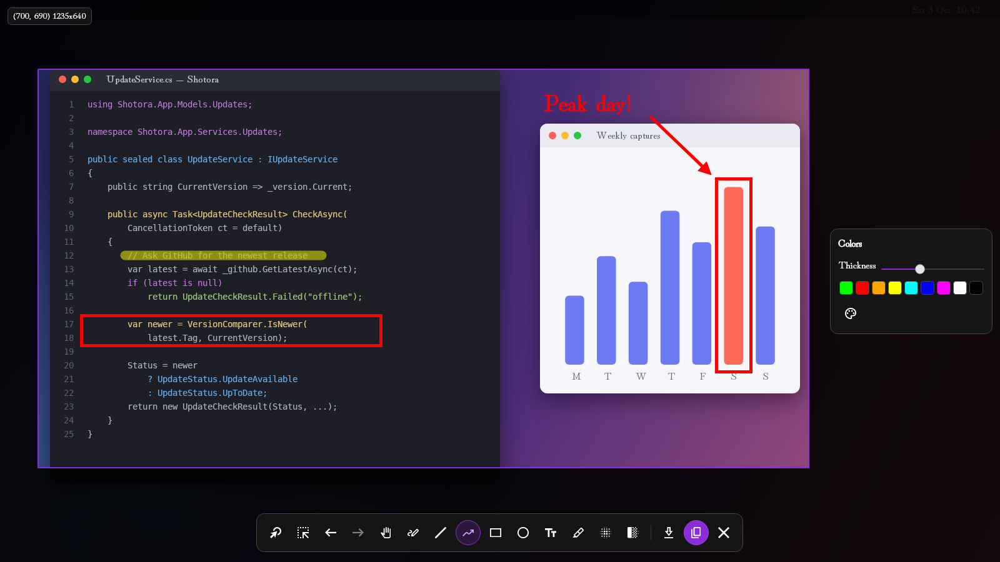

</div>

## Why Shotora

| Private by design | Annotate fast | Read text with OCR | Stays up to date |
| :-- | :-- | :-- | :-- |
| Screenshots and recognized text never leave your computer. No account, no cloud upload. | Draw a region and mark it up in place: arrows, shapes, text, highlight, blur and pixelate. | Release the mouse and the text in your selection is recognized locally with Tesseract or EasyOCR. | Installed copies check GitHub Releases and update themselves in place, only when you say so. |

Shotora lives in the system tray, starts a capture with one hotkey or one click, and gets out of the way. It is built with
[Avalonia UI](https://avaloniaui.net/) on .NET 10, so it looks and behaves the same on every desktop it supports.

## Download

Get the latest version from the [Releases page](https://github.com/Adhamura/Shotora/releases/latest), or use the direct links below.

| Platform | Installer (auto-updates) | Portable | Notes |
| :-- | :-- | :-- | :-- |
| **Windows** x64 | [Shotora-win-x64-Setup.exe](https://github.com/Adhamura/Shotora/releases/latest/download/Shotora-win-x64-Setup.exe) | [Shotora-win-x64-Portable.zip](https://github.com/Adhamura/Shotora/releases/latest/download/Shotora-win-x64-Portable.zip) | Per-user install, no admin rights needed |
| **macOS** Apple Silicon | [Shotora-osx-arm64-Setup.pkg](https://github.com/Adhamura/Shotora/releases/latest/download/Shotora-osx-arm64-Setup.pkg) | [Shotora-osx-arm64-Portable.zip](https://github.com/Adhamura/Shotora/releases/latest/download/Shotora-osx-arm64-Portable.zip) | See the OCR note below |
| **macOS** Intel | [Shotora-osx-x64-Setup.pkg](https://github.com/Adhamura/Shotora/releases/latest/download/Shotora-osx-x64-Setup.pkg) | [Shotora-osx-x64-Portable.zip](https://github.com/Adhamura/Shotora/releases/latest/download/Shotora-osx-x64-Portable.zip) | |
| **Linux** x64 | [Shotora-linux-x64.AppImage](https://github.com/Adhamura/Shotora/releases/latest/download/Shotora-linux-x64.AppImage) | (the AppImage is self-contained) | X11 session required |

Installers and the AppImage update themselves in place. Portable builds can still check for updates, but they send you to the
release page to download the new version.

> [!WARNING]
> **The builds are not code-signed yet**, so your OS will warn you the first time you open one:
>
> - **Windows:** SmartScreen shows "Windows protected your PC". Click **More info**, then **Run anyway**.
> - **macOS:** Gatekeeper blocks the app. Right-click it and choose **Open**, or go to **System Settings → Privacy & Security** and click **Open Anyway**.
> - **Linux:** make the AppImage executable first: `chmod +x Shotora-linux-x64.AppImage`, then run it.
>
> To check that a download is intact, see [Verifying downloads](#verifying-downloads).

> [!NOTE]
> **OCR on Apple Silicon:** the `osx-arm64` build does not bundle the native OCR runtimes yet (Tesseract libraries and
> the embedded Python used by EasyOCR). Capture and annotation work normally. If you need OCR on an Apple Silicon Mac,
> use the Intel (`osx-x64`) build for now.

### System requirements

- **Windows:** 64-bit Windows 10 or later.
- **macOS:** Apple Silicon or Intel Mac. macOS asks for **Screen Recording** permission the first time you capture.
- **Linux:** x64 desktop running an **X11** session with a system tray. Wayland sessions are not supported for capture yet.
- No .NET installation needed. All release builds are self-contained.

### Verifying downloads

GitHub shows a SHA-256 digest next to each asset on the [release page](https://github.com/Adhamura/Shotora/releases/latest).
Compute the hash of your download and compare the two values:

```powershell
# Windows (PowerShell)
Get-FileHash -Algorithm SHA256 .\Shotora-win-x64-Setup.exe
```

```bash
# macOS
shasum -a 256 Shotora-osx-arm64-Setup.pkg
# Linux
sha256sum Shotora-linux-x64.AppImage
```

## Features

### Capture

- **Region capture.** Drag a rectangle anywhere on screen. Resize it with handles or move it afterwards, and Shotora remembers the last selection.
- **Full-screen capture.** Starts with the whole screen already selected.
- **Multi-monitor.** The capture overlay spans all connected displays.
- **Copy or save.** Copy to the clipboard (`Ctrl + C`, or right-click inside the selection), or save as PNG or JPEG (`Ctrl + S`).

### Annotation tools

<p align="center">
  <picture>
    <source media="(prefers-color-scheme: light)" srcset="docs/images/toolbar-light.png" />
    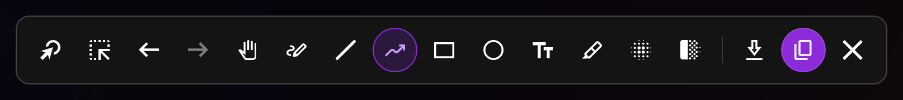
  </picture>
</p>

| Tool | What it does |
| :-- | :-- |
| **Pointer** | Select, drag and re-edit existing annotations. Double-click a text annotation to edit it. |
| **Region** | Draw or redraw the capture selection. |
| **Move** | Move the selection around the screen. |
| **Pen** | Freehand drawing. |
| **Line** / **Arrow** | Straight lines and arrows. |
| **Rectangle** / **Ellipse** | Outline shapes. |
| **Text** | Place text, with a choice of font, size, bold and italic. |
| **Highlight** | Wide, translucent freehand marker for emphasis. |
| **Blur** / **Pixelate** | Hide sensitive information before you share. |

The editor also has **undo/redo**, a **color palette** with a full color picker, an adjustable **stroke thickness** (1 to 12),
and a configurable **default color and thickness**. You can hide any toolbar button you don't use from **Settings → Editor**.

### OCR (text recognition)

When you finish drawing a selection, Shotora recognizes the text inside it and shows the result in a small window with a
**Copy** button. Choose the engine and recognition languages in **Settings → Main → OCR**.

| | Tesseract (default) | EasyOCR |
| :-- | :-- | :-- |
| **Runs** | Natively, in-process | Embedded Python runtime shipped with Shotora |
| **Setup** | None. Language data downloads on demand. | One click: **Settings → Install** sets up the `easyocr` package |
| **Engine** | Classic OCR engine, fast and lightweight | Deep-learning recognizer, heavier but often more robust on noisy text |
| **Footprint** | Small: one data file per language | Large: the `easyocr` package pulls in PyTorch and downloads recognition models |

Both engines run entirely on your machine. Your screenshots are never uploaded.

### Customization

- **Three themes:** Dark, Light and Sunset, switchable at runtime.
- **73 interface languages.**
- **Configurable hotkeys** for capture and for editor actions, plus configurable mouse buttons.
- **Export:** PNG or JPEG (adjustable quality, 90 by default), a default save folder (`Pictures/Shotora`), and a filename
  pattern using .NET date formatting, such as `Shotora_{0:yyyy-MM-dd_HH-mm-ss}`.
- **Run on startup** on Windows, macOS and Linux.

### Automatic updates

New in **v1.1.0**. Shotora checks [GitHub Releases](https://github.com/Adhamura/Shotora/releases) shortly after it starts and then
at most once every 24 hours. When a new version is available, it shows the release notes and lets you **Download and
install**, **Remind me later** or **Skip this version**. It never interrupts a capture in progress. You can also check
manually from the tray menu (**Check for Updates**), or turn automatic checks off with **Settings → Main → Automatically
check for updates**.

## Usage

### Quick start

1. **Launch Shotora.** It starts in the system tray. Right-click the tray icon for Capture Region, Capture Full Screen, Settings, About and Check for Updates.
2. **Capture.** Press the capture hotkey or choose a capture from the tray menu, then drag a region.
3. **Annotate.** Pick a tool from the toolbar, and a color and thickness from the side panel.
4. **Finish.** Copy (`Ctrl + C` or right-click), save (`Ctrl + S`), or copy the recognized text from the OCR window. Press `Esc` to close.

### Default hotkeys

| Action | Shortcut |
| :-- | :-- |
| Region capture | `Ctrl + Shift + PrintScreen` |
| Full-screen capture | `Alt + PrintScreen` |

> [!NOTE]
> Global capture hotkeys are currently registered **on Windows only**. On macOS and Linux, start a capture from the tray menu.
> You can change every hotkey in **Settings → Hotkeys**.

### Editor shortcuts

| Key / mouse | Action |
| :-- | :-- |
| `Ctrl + Z` / `Ctrl + Y` | Undo / redo |
| `Ctrl + C` | Copy the selection to the clipboard and close |
| `Ctrl + S` | Save the selection to a file |
| Right-click inside the selection | Copy and close (button configurable) |
| `Esc` | Return to the Region tool, or close the editor |

## Screenshots

<table>
  <tr>
    <th align="center">Dark</th>
    <th align="center">Light</th>
    <th align="center">Sunset</th>
  </tr>
  <tr>
    <td>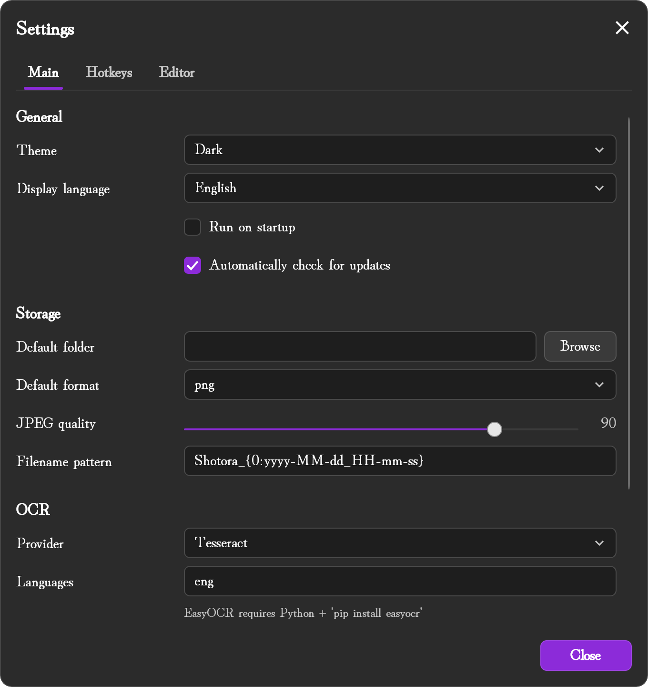</td>
    <td>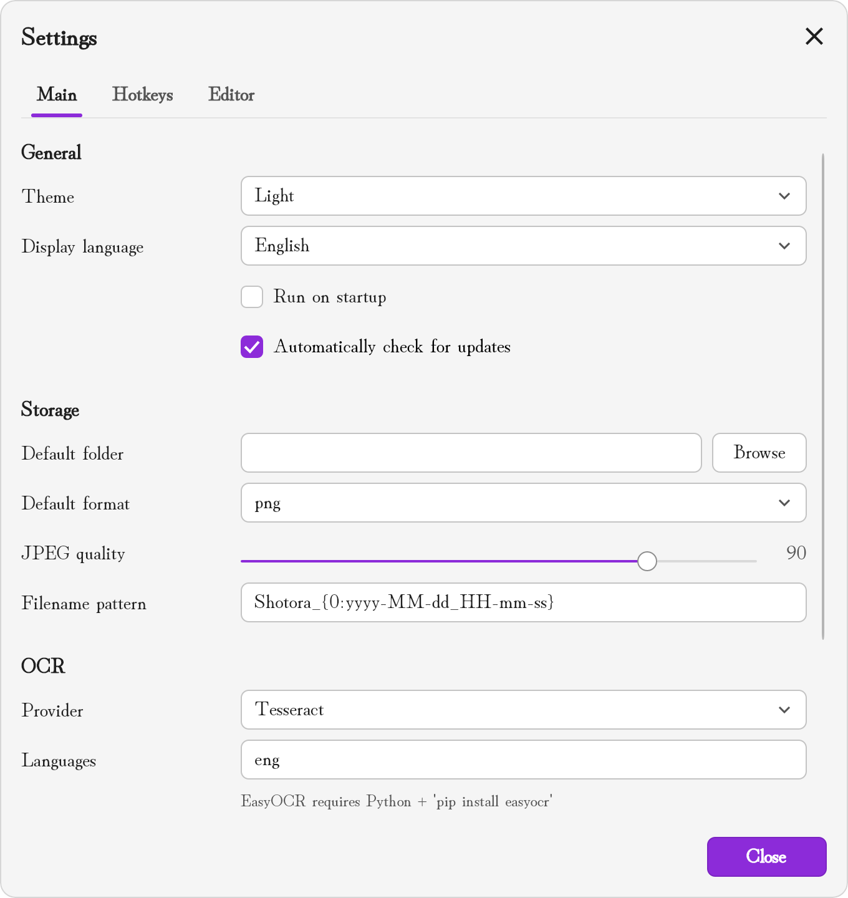</td>
    <td>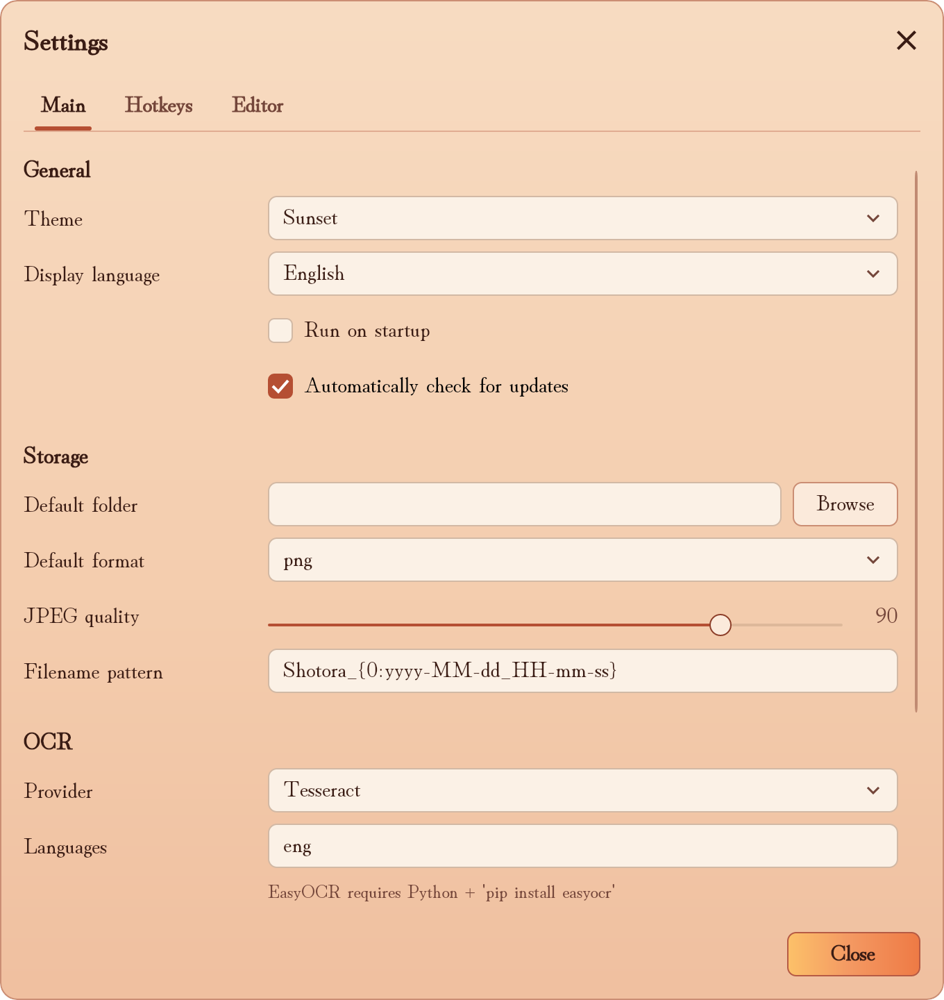</td>
  </tr>
</table>

<details>
<summary><strong>More screenshots</strong>: hotkeys, editor settings, updates and About</summary>
<br />

| | Dark | Light |
| :-- | :-- | :-- |
| **Hotkeys** | 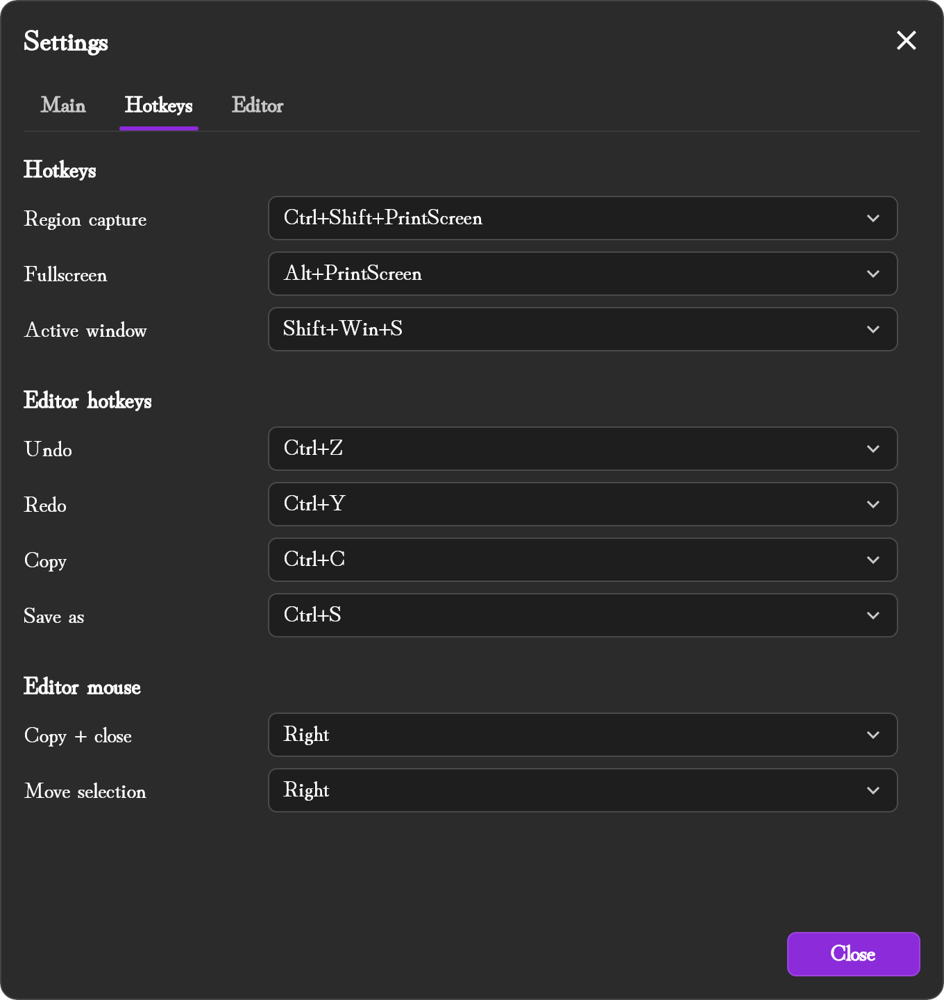 | 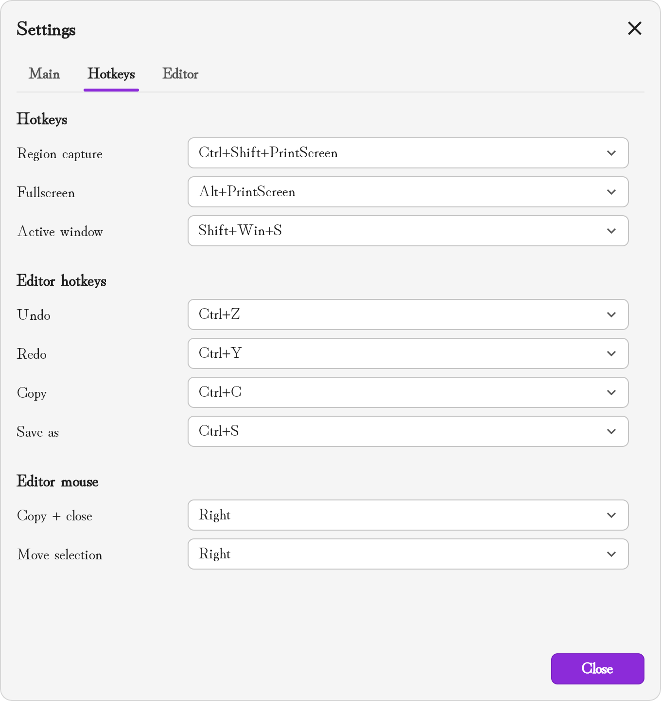 |
| **Editor** | 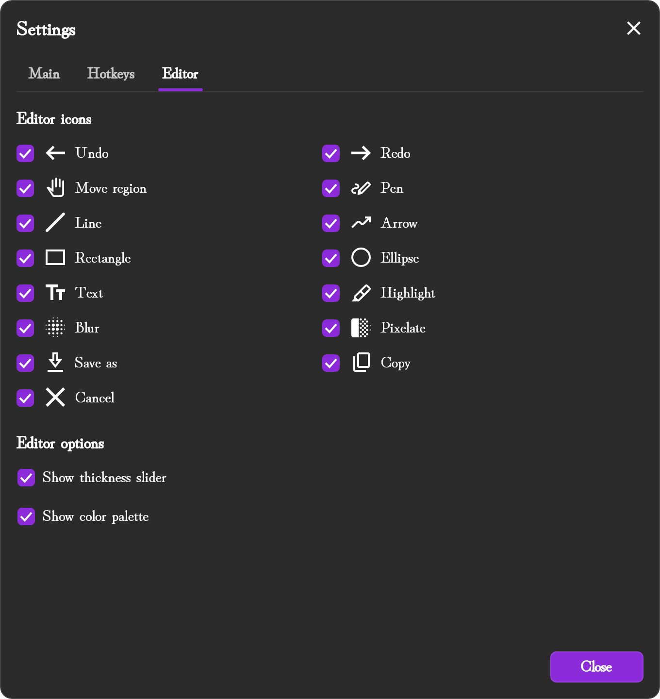 | 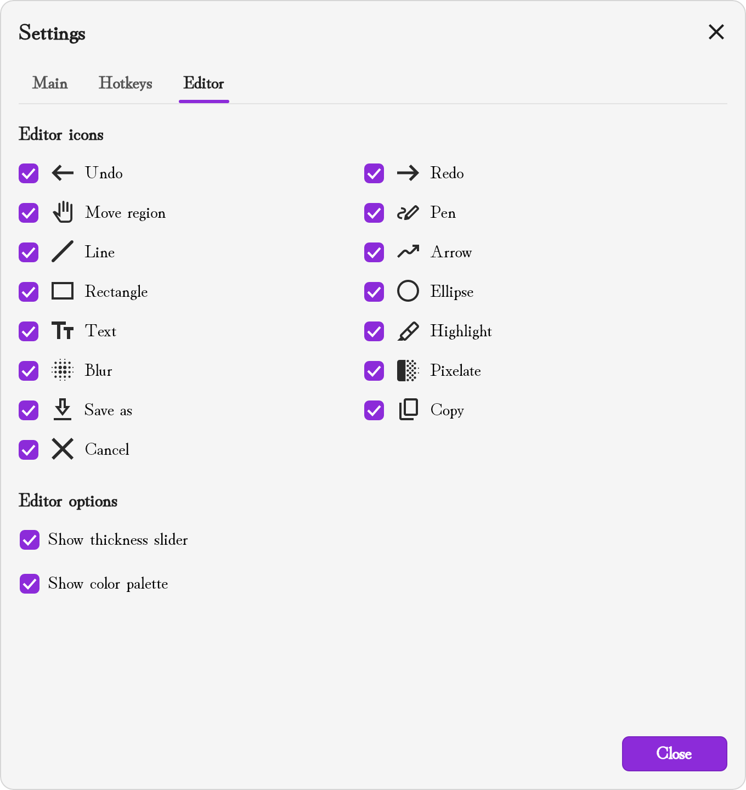 |
| **Update** | 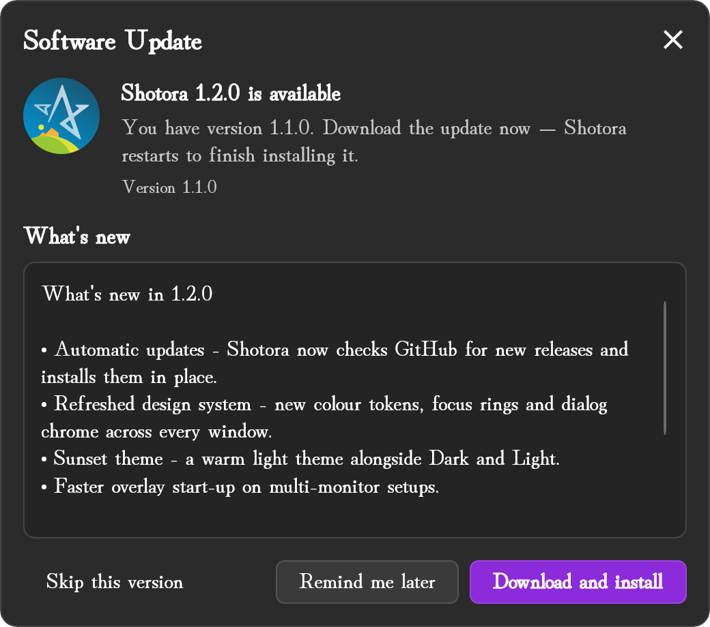 | 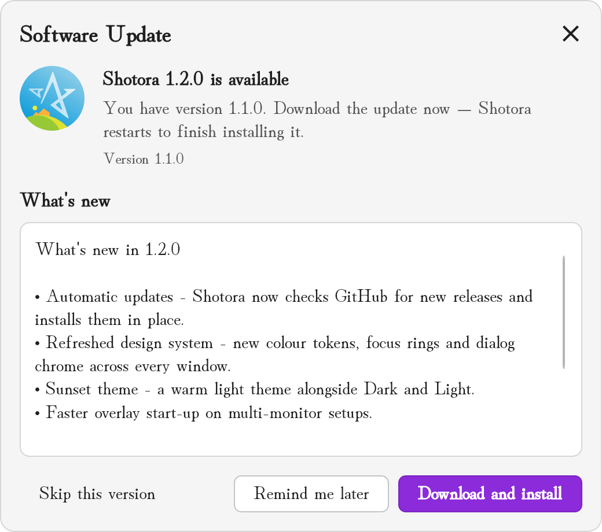 |
| **About** | 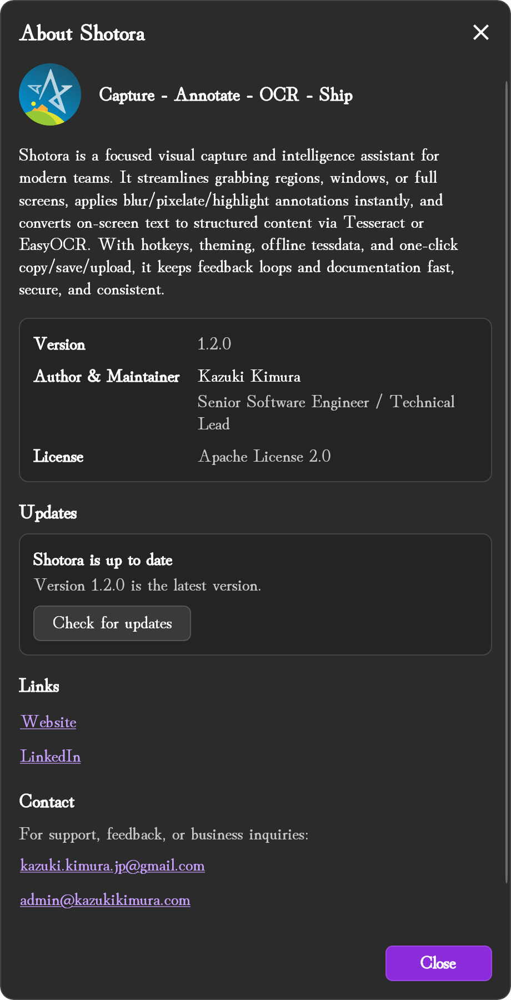 | |

</details>

## Privacy

Shotora has no telemetry, no analytics and no account. Captures, annotations and recognized text stay on your computer.
Shotora only goes online in these cases:

| When | Where | Why |
| :-- | :-- | :-- |
| Automatic or manual update check | `api.github.com` and `github.com/Adhamura/Shotora/releases` | Find out whether a newer version exists, and download it when you choose to |
| You use a Tesseract language for the first time | `github.com/tesseract-ocr/tessdata_best` (fallback `tessdata_fast`) | Download that language's `.traineddata` file |
| You click **Install** for EasyOCR | `bootstrap.pypa.io` and the Python Package Index | Install `pip` and the `easyocr` package into Shotora's embedded Python |
| First EasyOCR recognition for a language | EasyOCR's model host | The EasyOCR library downloads its detection and recognition models |

To turn off automatic update checks, clear **Settings → Main → Automatically check for updates**. Settings are stored in
`Shotora/config.json` under your user application-data folder (`%APPDATA%` on Windows, `~/.config` on macOS and Linux),
next to downloaded Tesseract language files (`Shotora/tessdata`).

## Build from source

**Prerequisites:** [.NET 10 SDK](https://dotnet.microsoft.com/download/dotnet/10.0) and Git. No separate Python installation is needed.

```bash
git clone https://github.com/Adhamura/Shotora.git
cd Shotora
dotnet tool restore                      # Cake and the Velopack CLI (vpk), pinned in dotnet-tools.json
dotnet build Shotora.sln
dotnet run --project Shotora.App/Shotora.App.csproj
```

Run the tests the same way CI does. The Avalonia UI tests share one dispatcher thread, so test collections run serially:

```bash
dotnet test Shotora.App.Tests -c Release -- xUnit.ParallelizeTestCollections=false
```

<details>
<summary><strong>Publishing and packaging</strong> (Cake and Velopack)</summary>
<br />

Self-contained builds are produced by the Cake script [`build.cake`](build.cake). Always pass `--runtime`, because the script's
default runtime is `linux-arm64`:

```bash
dotnet tool run dotnet-cake --target=Publish --runtime=win-x64 --configuration=Release \
  --selfcontained=true --appversion=1.2.3 --output=./publish/win-x64
```

| Argument | Purpose |
| :-- | :-- |
| `--runtime` | Target RID. Released platforms are `win-x64`, `osx-arm64`, `osx-x64` and `linux-x64`. |
| `--configuration` | `Release` (default) or `Debug` |
| `--selfcontained` / `--singlefile` | Bundle the .NET runtime / publish as a single file |
| `--appversion` | Stamps the assemblies with a version. The in-app updater compares against it. |
| `--output` | Publish directory (default `./ready`) |

The release pipeline then packages each platform with the Velopack CLI:

```bash
dotnet tool run vpk pack --packId Shotora --packTitle Shotora --packVersion 1.2.3 \
  --packDir ./publish/win-x64 --mainExe Shotora.App.exe --runtime win-x64 --channel win-x64 \
  --icon Shotora.App/Assets/Shotora.ico --outputDir ./releases
```

`vpk` targets an older .NET runtime, so set `DOTNET_ROLL_FORWARD=LatestMajor` when you run it on a machine that only has .NET 10.
Each platform must be packed on its own OS (`Setup.exe` on Windows, `.pkg` on macOS, `.AppImage` on Linux). See
[`.github/workflows/release.yml`](.github/workflows/release.yml) for the exact steps.

</details>

### Architecture

| Project | Responsibility |
| :-- | :-- |
| `Shotora.App` | Avalonia application: windows, custom controls, styles and themes, 73 localization dictionaries, startup and DI composition |
| `Shotora.App.Interfaces` | Service, provider and view-model contracts |
| `Shotora.App.Models` | Settings, enums, constants, drawing and view-model base models |
| `Shotora.App.Services` | Implementations: capture, drawing, OCR (Tesseract and EasyOCR), hotkeys, tray, settings and updates |
| `Shared.Interfaces` / `Shared.Models` / `Shared.Services` | Cross-cutting adapters and facades (file system, environment, HTTP) shared by all layers |
| `NativeSupport` | Bundled native Tesseract and Leptonica libraries and the loader that resolves them per OS and architecture |
| `Shotora.App.Tests` | xUnit tests with Moq and Avalonia.Headless |

The app follows **MVVM** with [CommunityToolkit.Mvvm](https://github.com/CommunityToolkit/dotnet). Views live in `Shotora.App`,
contracts in `*.Interfaces`, and implementations in `*.Services`. Services are registered **by convention**: every class
`Foo` that implements `IFoo` is added to `Microsoft.Extensions.DependencyInjection` automatically. UI tokens, theme brushes
and component rules are documented in the [design system](docs/design/DESIGN_SYSTEM.md).

### Releasing

Releases are fully automated by [`.github/workflows/release.yml`](.github/workflows/release.yml):

1. Push a tag such as `v1.2.0`, or run the **Release** workflow manually and enter a version.
2. The workflow builds and tests the solution, then publishes and packs `win-x64`, `linux-x64`, `osx-arm64` and `osx-x64`
   on their native runners. It generates release notes from the commit log.
3. It creates a single GitHub release with every installer, portable package and Velopack feed file. Installed copies of
   Shotora pick it up through the in-app updater. A version with a suffix (for example `1.2.0-beta.1`) is published as a pre-release.

## Contributing

Issues and pull requests are welcome.

- **Report a bug or request a feature** on the [issue tracker](https://github.com/Adhamura/Shotora/issues). Include your OS, the Shotora version (shown in **About**) and steps to reproduce.
- **Before opening a PR**, make sure `dotnet build` and the test command above pass. [CI](.github/workflows/ci.yml) runs both on every pull request.
- **UI changes** should follow the [design system](docs/design/DESIGN_SYSTEM.md): use the shared tokens and control styles,
  and add every new brush to all three themes.
- **Translations** live in `Shotora.App/Resources/Languages/Strings.<code>.axaml`. A new string needs an entry in every language file.

A detailed (older) test-coverage report is available in [COVERAGE-DETAILED.md](COVERAGE-DETAILED.md).

## License

Shotora is licensed under the [Apache License 2.0](LICENSE).

## Acknowledgements

Shotora builds on these open-source projects:
[Avalonia UI](https://github.com/AvaloniaUI/Avalonia) ·
[Velopack](https://github.com/velopack/velopack) ·
[SkiaSharp](https://github.com/mono/SkiaSharp) ·
[Tesseract](https://github.com/tesseract-ocr/tesseract) (via the [Tesseract .NET wrapper](https://github.com/charlesw/tesseract)) ·
[EasyOCR](https://github.com/JaidedAI/EasyOCR) ·
[CommunityToolkit.Mvvm](https://github.com/CommunityToolkit/dotnet) ·
[H.NotifyIcon](https://github.com/HavenDV/H.NotifyIcon) ·
[Cake](https://github.com/cake-build/cake) ·
[xUnit](https://github.com/xunit/xunit) and [Moq](https://github.com/devlooped/moq).

## Author

**Kazuki Kimura**:
[Website](https://www.kazukikimura.com) ·
[LinkedIn](https://www.linkedin.com/in/kazuki-kimura/) ·
[Email](mailto:kazuki.kimura.jp@gmail.com) ·
[LINE](https://line.me/ti/p/adhamura) ·
[Instagram](https://www.instagram.com/kimura_kazuki_official/)

<sub>If Shotora is useful to you, a star on GitHub helps other people find it.</sub>
